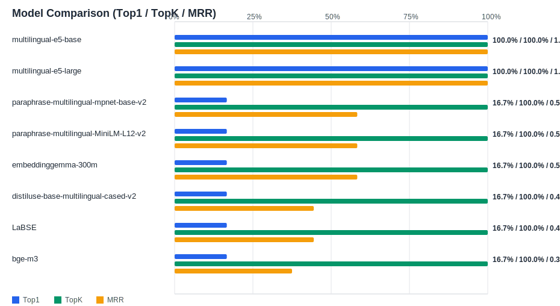

# Evaluation Report

Generated: 2026-02-20 17:45:47

## Inputs
- Summary CSV: `summary_20260220_174514.csv`
- Details CSV: `details_20260220_174514.csv`

## Metric Meaning
- **Top1 Accuracy**: Anteil Queries mit korrektem Material auf Rang 1.
- **TOP5 Accuracy**: Anteil Queries, bei denen das korrekte Material in den Top-K liegt.
- **MRR**: Mittelwert von `1/Rang` des korrekten Treffers (höher = besseres Ranking).
- **Avg Expected Score**: Mittlerer Similarity-Score des korrekten Materials (nur innerhalb eines Modells direkt sinnvoll).

## Overview

## Leaderboard

| Rank | Model | Cases | Top1 | TopK | MRR | Avg expected score | Top1 errors |
|---:|---|---:|---:|---:|---:|---:|---:|
| 1 | intfloat/multilingual-e5-base | 6 | 100.0% | 100.0% | 1.000 | 0.894 | 0 |
| 2 | intfloat/multilingual-e5-large | 6 | 100.0% | 100.0% | 1.000 | 0.888 | 0 |
| 3 | sentence-transformers/paraphrase-multilingual-mpnet-base-v2 | 6 | 16.7% | 100.0% | 0.583 | 0.733 | 5 |
| 4 | sentence-transformers/paraphrase-multilingual-MiniLM-L12-v2 | 6 | 16.7% | 100.0% | 0.583 | 0.655 | 5 |
| 5 | google/embeddinggemma-300m | 6 | 16.7% | 100.0% | 0.583 | 0.654 | 5 |
| 6 | sentence-transformers/distiluse-base-multilingual-cased-v2 | 6 | 16.7% | 100.0% | 0.444 | 0.560 | 5 |
| 7 | sentence-transformers/LaBSE | 6 | 16.7% | 100.0% | 0.444 | 0.538 | 5 |
| 8 | BAAI/bge-m3 | 6 | 16.7% | 100.0% | 0.375 | 0.623 | 5 |

## Hardest Queries
Queries mit den meisten Top1-Fehlern über alle Modelle:

- (30 Fehler) IfcPile BORED Betonpfahl Beton D800 800 Ortbeton
