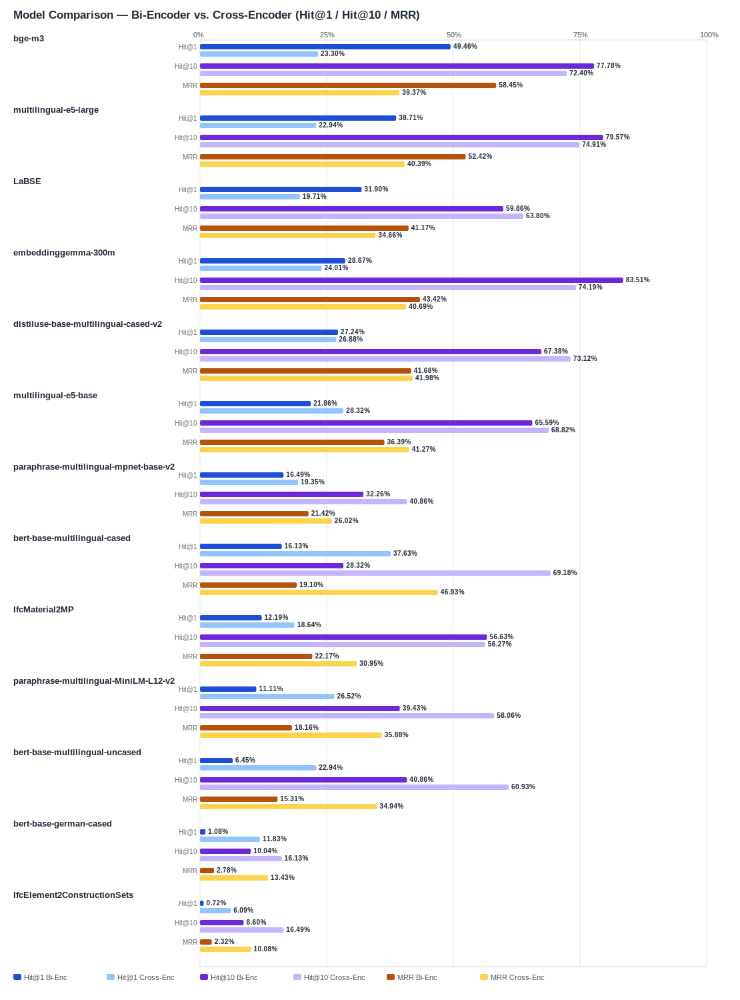

## Evaluation Report

Generated: 2026-02-28 21:09:10

### Inputs
- Summary CSV: `summary_ifcentity_material_bge-reranker-v2-m3.csv`
- Details CSV: `details_ifcentity_material_bge-reranker-v2-m3.csv`

### Overview

### Leaderboard

#### Baseline (Bi-Encoder)

| Rank | Model | Hit@1 | Hit@10 | Hit@20 | Hit@30 | Hit@50 | MRR@10 | MAP@10 | nDCG@10 | Recall@10 | Avg expected score | Hit@1 95% CI | Hit@10 95% CI | MRR@10 95% CI | nDCG@10 95% CI | Top1 errors |
|---:|---|---:|---:|---:|---:|---:|---:|---:|---:|---:|---:|---|---|---|---|---:|
| 1 | BAAI/bge-m3 | 49.46% | 77.78% | 84.95% | 89.61% | 91.76% | 0.584 | 0.515 | 0.580 | 0.688 | 0.552 | [0.444, 0.552] | [0.731, 0.828] | [0.542, 0.635] | [0.539, 0.627] | 141 |
| 2 | intfloat/multilingual-e5-large | 38.71% | 79.57% | 86.74% | 89.61% | 92.11% | 0.524 | 0.472 | 0.549 | 0.701 | 0.860 | [0.337, 0.444] | [0.749, 0.842] | [0.480, 0.570] | [0.510, 0.594] | 171 |
| 3 | sentence-transformers/LaBSE | 31.90% | 59.86% | 73.48% | 83.87% | 90.32% | 0.412 | 0.353 | 0.418 | 0.535 | 0.544 | [0.258, 0.375] | [0.541, 0.656] | [0.358, 0.464] | [0.370, 0.465] | 190 |
| 4 | google/embeddinggemma-300m | 28.67% | 83.51% | 84.59% | 92.83% | 98.57% | 0.434 | 0.368 | 0.495 | 0.780 | 0.624 | [0.240, 0.348] | [0.792, 0.880] | [0.400, 0.485] | [0.465, 0.536] | 199 |
| 5 | sentence-transformers/distiluse-base-multilingual-cased-v2 | 27.24% | 67.38% | 81.36% | 84.95% | 91.04% | 0.417 | 0.332 | 0.426 | 0.597 | 0.662 | [0.228, 0.330] | [0.616, 0.728] | [0.374, 0.467] | [0.390, 0.466] | 203 |
| 6 | intfloat/multilingual-e5-base | 21.86% | 65.59% | 78.85% | 84.23% | 88.17% | 0.364 | 0.303 | 0.374 | 0.523 | 0.864 | [0.174, 0.267] | [0.609, 0.710] | [0.319, 0.407] | [0.337, 0.416] | 218 |
| 7 | sentence-transformers/paraphrase-multilingual-mpnet-base-v2 | 16.49% | 32.26% | 45.88% | 59.14% | 74.91% | 0.214 | 0.114 | 0.153 | 0.167 | 0.564 | [0.125, 0.212] | [0.276, 0.384] | [0.177, 0.258] | [0.127, 0.187] | 233 |
| 8 | google-bert/bert-base-multilingual-cased | 16.13% | 28.32% | 51.25% | 75.27% | 87.46% | 0.191 | 0.132 | 0.160 | 0.187 | 0.644 | [0.122, 0.206] | [0.238, 0.342] | [0.154, 0.236] | [0.130, 0.196] | 234 |
| 9 | kforth/IfcMaterial2MP | 12.19% | 56.63% | 68.82% | 72.04% | 82.80% | 0.222 | 0.161 | 0.230 | 0.361 | 0.603 | [0.086, 0.158] | [0.511, 0.624] | [0.185, 0.260] | [0.198, 0.262] | 245 |
| 10 | sentence-transformers/paraphrase-multilingual-MiniLM-L12-v2 | 11.11% | 39.43% | 57.35% | 67.74% | 83.51% | 0.182 | 0.110 | 0.159 | 0.222 | 0.526 | [0.075, 0.143] | [0.344, 0.455] | [0.150, 0.220] | [0.132, 0.191] | 248 |
| 11 | google-bert/bert-base-multilingual-uncased | 6.45% | 40.86% | 66.31% | 78.85% | 87.10% | 0.153 | 0.097 | 0.153 | 0.248 | 0.708 | [0.039, 0.095] | [0.353, 0.462] | [0.123, 0.185] | [0.127, 0.178] | 261 |
| 12 | google-bert/bert-base-german-cased | 1.08% | 10.04% | 17.56% | 20.07% | 26.16% | 0.028 | 0.016 | 0.027 | 0.046 | 0.831 | [0.000, 0.025] | [0.068, 0.136] | [0.015, 0.042] | [0.016, 0.038] | 276 |
| 13 | kforth/IfcElement2ConstructionSets | 0.72% | 8.60% | 13.26% | 24.73% | 41.94% | 0.023 | 0.016 | 0.028 | 0.053 | 0.982 | [0.000, 0.018] | [0.057, 0.115] | [0.013, 0.035] | [0.016, 0.041] | 277 |

#### Reranked (Bi-Encoder + Cross-Encoder)

| Rank | Model | Cross-Encoder | Hit@1 | Hit@10 | Hit@20 | Hit@30 | Hit@50 | MRR@10 | MAP@10 | nDCG@10 | Recall@10 | Avg expected score | Hit@1 95% CI | Hit@10 95% CI | MRR@10 95% CI | nDCG@10 95% CI | Top1 errors |
|---:|---|---|---:|---:|---:|---:|---:|---:|---:|---:|---:|---:|---|---|---|---|---:|
| 1 | google-bert/bert-base-multilingual-cased | BAAI/bge-reranker-v2-m3 | 37.63% | 69.18% | 73.48% | 75.27% | 87.46% | 0.469 | 0.324 | 0.405 | 0.504 | 0.520 | [0.326, 0.439] | [0.638, 0.744] | [0.421, 0.528] | [0.366, 0.449] | 174 |
| 2 | intfloat/multilingual-e5-base | BAAI/bge-reranker-v2-m3 | 28.32% | 68.82% | 77.06% | 84.23% | 88.17% | 0.413 | 0.286 | 0.379 | 0.521 | 0.533 | [0.237, 0.342] | [0.641, 0.746] | [0.369, 0.467] | [0.347, 0.424] | 200 |
| 3 | sentence-transformers/distiluse-base-multilingual-cased-v2 | BAAI/bge-reranker-v2-m3 | 26.88% | 73.12% | 83.51% | 84.95% | 91.04% | 0.420 | 0.312 | 0.405 | 0.551 | 0.540 | [0.220, 0.321] | [0.688, 0.787] | [0.381, 0.464] | [0.375, 0.444] | 204 |
| 4 | sentence-transformers/paraphrase-multilingual-MiniLM-L12-v2 | BAAI/bge-reranker-v2-m3 | 26.52% | 58.06% | 64.87% | 67.74% | 83.51% | 0.359 | 0.259 | 0.327 | 0.425 | 0.523 | [0.219, 0.315] | [0.530, 0.634] | [0.318, 0.406] | [0.290, 0.372] | 205 |
| 5 | google/embeddinggemma-300m | BAAI/bge-reranker-v2-m3 | 24.01% | 74.19% | 88.53% | 92.83% | 98.57% | 0.407 | 0.301 | 0.399 | 0.567 | 0.541 | [0.194, 0.294] | [0.700, 0.801] | [0.370, 0.451] | [0.366, 0.440] | 212 |
| 6 | BAAI/bge-m3 | BAAI/bge-reranker-v2-m3 | 23.30% | 72.40% | 82.80% | 89.61% | 91.76% | 0.394 | 0.288 | 0.383 | 0.544 | 0.541 | [0.188, 0.285] | [0.686, 0.783] | [0.357, 0.438] | [0.351, 0.422] | 214 |
| 7 | intfloat/multilingual-e5-large | BAAI/bge-reranker-v2-m3 | 22.94% | 74.91% | 84.23% | 89.61% | 92.11% | 0.404 | 0.303 | 0.402 | 0.579 | 0.541 | [0.186, 0.283] | [0.704, 0.799] | [0.366, 0.449] | [0.367, 0.441] | 215 |
| 8 | google-bert/bert-base-multilingual-uncased | BAAI/bge-reranker-v2-m3 | 22.94% | 60.93% | 75.99% | 78.85% | 87.10% | 0.349 | 0.234 | 0.310 | 0.424 | 0.532 | [0.179, 0.281] | [0.556, 0.661] | [0.304, 0.392] | [0.273, 0.346] | 215 |
| 9 | sentence-transformers/LaBSE | BAAI/bge-reranker-v2-m3 | 19.71% | 63.80% | 73.12% | 83.87% | 90.32% | 0.347 | 0.246 | 0.328 | 0.448 | 0.540 | [0.151, 0.244] | [0.590, 0.692] | [0.309, 0.389] | [0.295, 0.365] | 224 |
| 10 | sentence-transformers/paraphrase-multilingual-mpnet-base-v2 | BAAI/bge-reranker-v2-m3 | 19.35% | 40.86% | 55.56% | 59.14% | 74.91% | 0.260 | 0.211 | 0.255 | 0.325 | 0.514 | [0.152, 0.244] | [0.353, 0.470] | [0.216, 0.311] | [0.212, 0.303] | 225 |
| 11 | kforth/IfcMaterial2MP | BAAI/bge-reranker-v2-m3 | 18.64% | 56.27% | 68.82% | 72.04% | 82.80% | 0.309 | 0.190 | 0.268 | 0.374 | 0.536 | [0.141, 0.229] | [0.516, 0.620] | [0.268, 0.353] | [0.235, 0.304] | 227 |
| 12 | google-bert/bert-base-german-cased | BAAI/bge-reranker-v2-m3 | 11.83% | 16.13% | 19.35% | 20.07% | 26.16% | 0.134 | 0.076 | 0.094 | 0.088 | 0.511 | [0.086, 0.154] | [0.122, 0.208] | [0.101, 0.171] | [0.072, 0.122] | 246 |
| 13 | kforth/IfcElement2ConstructionSets | BAAI/bge-reranker-v2-m3 | 6.09% | 16.49% | 19.35% | 24.73% | 41.94% | 0.101 | 0.036 | 0.058 | 0.067 | 0.514 | [0.032, 0.086] | [0.122, 0.204] | [0.071, 0.126] | [0.039, 0.075] | 262 |

Anzahl Queries: 279

### Hardest Queries (Baseline)
Queries mit den meisten Top1-Fehlern in der Baseline:

- (126 Fehler) IfcMember Stahl
- (122 Fehler) IfcBeam Beton
- (99 Fehler) IfcMember Holz
- (98 Fehler) IfcPile Beton
- (88 Fehler) IfcWall Beton

### Hardest Queries (Reranked)
Queries mit den meisten Top1-Fehlern nach Re-Ranking:

- (141 Fehler) IfcMember Stahl
- (108 Fehler) IfcMember Holz
- (103 Fehler) IfcBeam Beton
- (91 Fehler) IfcPlate Stahl
- (78 Fehler) IfcPlate Hochfester Stahl
