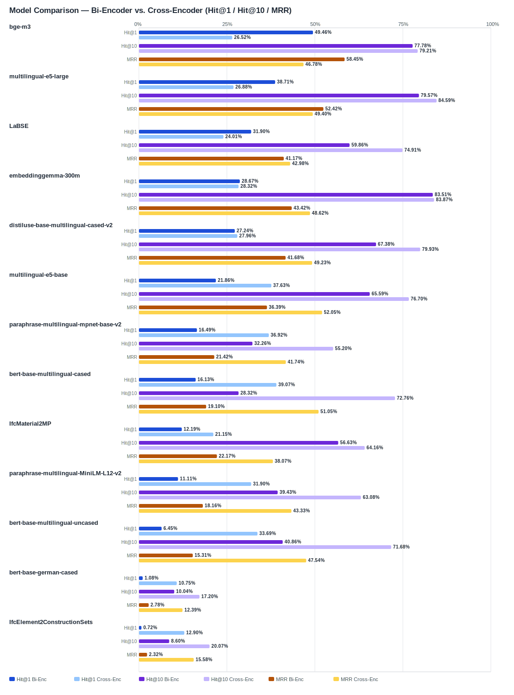

## Evaluation Report

Generated: 2026-02-28 20:21:20

### Inputs
- Summary CSV: `summary_ifcentity_material_jina-reranker-v2-base-multilingual.csv`
- Details CSV: `details_ifcentity_material_jina-reranker-v2-base-multilingual.csv`

### Overview

### Leaderboard

#### Baseline (Bi-Encoder)

| Rank | Model | Hit@1 | Hit@10 | Hit@20 | Hit@30 | Hit@50 | MRR@10 | MAP@10 | nDCG@10 | Recall@10 | Avg expected score | Hit@1 95% CI | Hit@10 95% CI | MRR@10 95% CI | nDCG@10 95% CI | Top1 errors |
|---:|---|---:|---:|---:|---:|---:|---:|---:|---:|---:|---:|---|---|---|---|---:|
| 1 | BAAI/bge-m3 | 49.46% | 77.78% | 84.95% | 89.61% | 91.76% | 0.584 | 0.515 | 0.580 | 0.688 | 0.552 | [0.444, 0.552] | [0.731, 0.828] | [0.542, 0.635] | [0.539, 0.627] | 141 |
| 2 | intfloat/multilingual-e5-large | 38.71% | 79.57% | 86.74% | 89.61% | 92.11% | 0.524 | 0.472 | 0.549 | 0.701 | 0.860 | [0.337, 0.444] | [0.749, 0.842] | [0.480, 0.570] | [0.510, 0.594] | 171 |
| 3 | sentence-transformers/LaBSE | 31.90% | 59.86% | 73.48% | 83.87% | 90.32% | 0.412 | 0.353 | 0.418 | 0.535 | 0.544 | [0.258, 0.375] | [0.541, 0.656] | [0.358, 0.464] | [0.370, 0.465] | 190 |
| 4 | google/embeddinggemma-300m | 28.67% | 83.51% | 84.59% | 92.83% | 98.57% | 0.434 | 0.368 | 0.495 | 0.780 | 0.624 | [0.240, 0.348] | [0.792, 0.880] | [0.400, 0.485] | [0.465, 0.536] | 199 |
| 5 | sentence-transformers/distiluse-base-multilingual-cased-v2 | 27.24% | 67.38% | 81.36% | 84.95% | 91.04% | 0.417 | 0.332 | 0.426 | 0.597 | 0.662 | [0.228, 0.330] | [0.616, 0.728] | [0.374, 0.467] | [0.390, 0.466] | 203 |
| 6 | intfloat/multilingual-e5-base | 21.86% | 65.59% | 78.85% | 84.23% | 88.17% | 0.364 | 0.303 | 0.374 | 0.523 | 0.864 | [0.174, 0.267] | [0.609, 0.710] | [0.319, 0.407] | [0.337, 0.416] | 218 |
| 7 | sentence-transformers/paraphrase-multilingual-mpnet-base-v2 | 16.49% | 32.26% | 45.88% | 59.14% | 74.91% | 0.214 | 0.114 | 0.153 | 0.167 | 0.564 | [0.125, 0.212] | [0.276, 0.384] | [0.177, 0.258] | [0.127, 0.187] | 233 |
| 8 | google-bert/bert-base-multilingual-cased | 16.13% | 28.32% | 51.25% | 75.27% | 87.46% | 0.191 | 0.132 | 0.160 | 0.187 | 0.644 | [0.122, 0.206] | [0.238, 0.342] | [0.154, 0.236] | [0.130, 0.196] | 234 |
| 9 | kforth/IfcMaterial2MP | 12.19% | 56.63% | 68.82% | 72.04% | 82.80% | 0.222 | 0.161 | 0.230 | 0.361 | 0.603 | [0.086, 0.158] | [0.511, 0.624] | [0.185, 0.260] | [0.198, 0.262] | 245 |
| 10 | sentence-transformers/paraphrase-multilingual-MiniLM-L12-v2 | 11.11% | 39.43% | 57.35% | 67.74% | 83.51% | 0.182 | 0.110 | 0.159 | 0.222 | 0.526 | [0.075, 0.143] | [0.344, 0.455] | [0.150, 0.220] | [0.132, 0.191] | 248 |
| 11 | google-bert/bert-base-multilingual-uncased | 6.45% | 40.86% | 66.31% | 78.85% | 87.10% | 0.153 | 0.097 | 0.153 | 0.248 | 0.708 | [0.039, 0.095] | [0.353, 0.462] | [0.123, 0.185] | [0.127, 0.178] | 261 |
| 12 | google-bert/bert-base-german-cased | 1.08% | 10.04% | 17.56% | 20.07% | 26.16% | 0.028 | 0.016 | 0.027 | 0.046 | 0.831 | [0.000, 0.025] | [0.068, 0.136] | [0.015, 0.042] | [0.016, 0.038] | 276 |
| 13 | kforth/IfcElement2ConstructionSets | 0.72% | 8.60% | 13.26% | 24.73% | 41.94% | 0.023 | 0.016 | 0.028 | 0.053 | 0.982 | [0.000, 0.018] | [0.057, 0.115] | [0.013, 0.035] | [0.016, 0.041] | 277 |

#### Reranked (Bi-Encoder + Cross-Encoder)

| Rank | Model | Cross-Encoder | Hit@1 | Hit@10 | Hit@20 | Hit@30 | Hit@50 | MRR@10 | MAP@10 | nDCG@10 | Recall@10 | Avg expected score | Hit@1 95% CI | Hit@10 95% CI | MRR@10 95% CI | nDCG@10 95% CI | Top1 errors |
|---:|---|---|---:|---:|---:|---:|---:|---:|---:|---:|---:|---:|---|---|---|---|---:|
| 1 | google-bert/bert-base-multilingual-cased | jinaai/jina-reranker-v2-base-multilingual | 39.07% | 72.76% | 74.55% | 75.27% | 87.46% | 0.510 | 0.398 | 0.468 | 0.557 | 0.543 | [0.337, 0.452] | [0.670, 0.778] | [0.461, 0.562] | [0.426, 0.516] | 170 |
| 2 | intfloat/multilingual-e5-base | jinaai/jina-reranker-v2-base-multilingual | 37.63% | 76.70% | 83.51% | 84.23% | 88.17% | 0.521 | 0.423 | 0.510 | 0.658 | 0.544 | [0.321, 0.439] | [0.715, 0.817] | [0.473, 0.573] | [0.468, 0.554] | 174 |
| 3 | sentence-transformers/paraphrase-multilingual-mpnet-base-v2 | jinaai/jina-reranker-v2-base-multilingual | 36.92% | 55.20% | 57.71% | 59.14% | 74.91% | 0.417 | 0.301 | 0.359 | 0.424 | 0.535 | [0.317, 0.434] | [0.500, 0.618] | [0.368, 0.480] | [0.319, 0.412] | 176 |
| 4 | google-bert/bert-base-multilingual-uncased | jinaai/jina-reranker-v2-base-multilingual | 33.69% | 71.68% | 77.78% | 78.85% | 87.10% | 0.475 | 0.373 | 0.447 | 0.565 | 0.543 | [0.285, 0.387] | [0.672, 0.774] | [0.429, 0.521] | [0.409, 0.489] | 185 |
| 5 | sentence-transformers/paraphrase-multilingual-MiniLM-L12-v2 | jinaai/jina-reranker-v2-base-multilingual | 31.90% | 63.08% | 66.67% | 67.74% | 83.51% | 0.433 | 0.302 | 0.382 | 0.485 | 0.539 | [0.263, 0.375] | [0.584, 0.690] | [0.382, 0.486] | [0.340, 0.426] | 190 |
| 6 | google/embeddinggemma-300m | jinaai/jina-reranker-v2-base-multilingual | 28.32% | 83.87% | 91.40% | 92.83% | 98.57% | 0.486 | 0.425 | 0.531 | 0.757 | 0.547 | [0.228, 0.330] | [0.796, 0.889] | [0.444, 0.526] | [0.494, 0.568] | 200 |
| 7 | sentence-transformers/distiluse-base-multilingual-cased-v2 | jinaai/jina-reranker-v2-base-multilingual | 27.96% | 79.93% | 83.87% | 84.95% | 91.04% | 0.492 | 0.412 | 0.511 | 0.692 | 0.545 | [0.231, 0.330] | [0.756, 0.839] | [0.454, 0.531] | [0.478, 0.544] | 201 |
| 8 | intfloat/multilingual-e5-large | jinaai/jina-reranker-v2-base-multilingual | 26.88% | 84.59% | 88.53% | 89.61% | 92.11% | 0.494 | 0.428 | 0.533 | 0.748 | 0.546 | [0.215, 0.317] | [0.801, 0.885] | [0.455, 0.534] | [0.497, 0.571] | 204 |
| 9 | BAAI/bge-m3 | jinaai/jina-reranker-v2-base-multilingual | 26.52% | 79.21% | 88.17% | 89.61% | 91.76% | 0.468 | 0.403 | 0.502 | 0.705 | 0.547 | [0.211, 0.315] | [0.746, 0.844] | [0.427, 0.510] | [0.463, 0.541] | 205 |
| 10 | sentence-transformers/LaBSE | jinaai/jina-reranker-v2-base-multilingual | 24.01% | 74.91% | 82.08% | 83.87% | 90.32% | 0.430 | 0.368 | 0.465 | 0.663 | 0.546 | [0.192, 0.289] | [0.697, 0.798] | [0.385, 0.474] | [0.426, 0.506] | 212 |
| 11 | kforth/IfcMaterial2MP | jinaai/jina-reranker-v2-base-multilingual | 21.15% | 64.16% | 68.46% | 72.04% | 82.80% | 0.381 | 0.307 | 0.383 | 0.509 | 0.546 | [0.170, 0.260] | [0.591, 0.695] | [0.343, 0.424] | [0.347, 0.428] | 220 |
| 12 | kforth/IfcElement2ConstructionSets | jinaai/jina-reranker-v2-base-multilingual | 12.90% | 20.07% | 21.86% | 24.73% | 41.94% | 0.156 | 0.058 | 0.085 | 0.085 | 0.532 | [0.090, 0.167] | [0.154, 0.237] | [0.117, 0.193] | [0.065, 0.104] | 243 |
| 13 | google-bert/bert-base-german-cased | jinaai/jina-reranker-v2-base-multilingual | 10.75% | 17.20% | 18.64% | 20.07% | 26.16% | 0.124 | 0.069 | 0.093 | 0.105 | 0.530 | [0.075, 0.143] | [0.129, 0.211] | [0.089, 0.159] | [0.069, 0.119] | 249 |

Anzahl Queries: 279

### Hardest Queries (Baseline)
Queries mit den meisten Top1-Fehlern in der Baseline:

- (126 Fehler) IfcMember Stahl
- (122 Fehler) IfcBeam Beton
- (99 Fehler) IfcMember Holz
- (98 Fehler) IfcPile Beton
- (88 Fehler) IfcWall Beton

### Hardest Queries (Reranked)
Queries mit den meisten Top1-Fehlern nach Re-Ranking:

- (133 Fehler) IfcBeam Beton
- (113 Fehler) IfcMember Stahl
- (100 Fehler) IfcPile Beton
- (78 Fehler) IfcPlate Hochfester Stahl
- (72 Fehler) IfcRamp Beton
