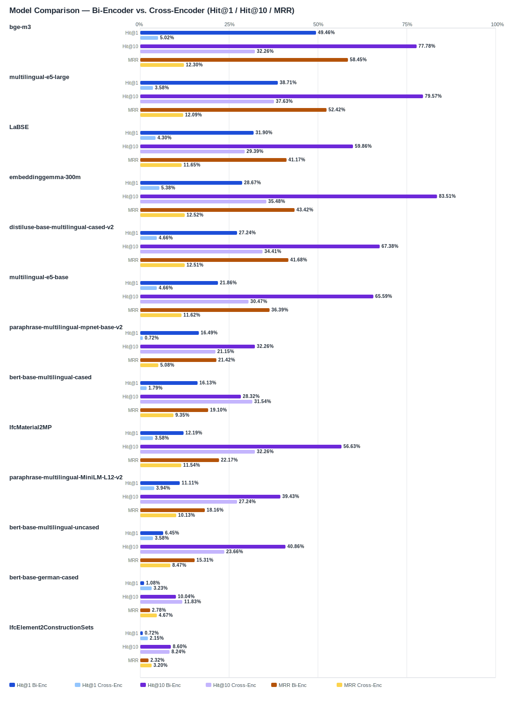

## Evaluation Report

Generated: 2026-02-28 20:24:56

### Inputs
- Summary CSV: `summary_ifcentity_material_mmarco-mMiniLMv2-L12-H384-v1.csv`
- Details CSV: `details_ifcentity_material_mmarco-mMiniLMv2-L12-H384-v1.csv`

### Overview

### Leaderboard

#### Baseline (Bi-Encoder)

| Rank | Model | Hit@1 | Hit@10 | Hit@20 | Hit@30 | Hit@50 | MRR@10 | MAP@10 | nDCG@10 | Recall@10 | Avg expected score | Hit@1 95% CI | Hit@10 95% CI | MRR@10 95% CI | nDCG@10 95% CI | Top1 errors |
|---:|---|---:|---:|---:|---:|---:|---:|---:|---:|---:|---:|---|---|---|---|---:|
| 1 | BAAI/bge-m3 | 49.46% | 77.78% | 84.95% | 89.61% | 91.76% | 0.584 | 0.515 | 0.580 | 0.688 | 0.552 | [0.444, 0.552] | [0.731, 0.828] | [0.542, 0.635] | [0.539, 0.627] | 141 |
| 2 | intfloat/multilingual-e5-large | 38.71% | 79.57% | 86.74% | 89.61% | 92.11% | 0.524 | 0.472 | 0.549 | 0.701 | 0.860 | [0.337, 0.444] | [0.749, 0.842] | [0.480, 0.570] | [0.510, 0.594] | 171 |
| 3 | sentence-transformers/LaBSE | 31.90% | 59.86% | 73.48% | 83.87% | 90.32% | 0.412 | 0.353 | 0.418 | 0.535 | 0.544 | [0.258, 0.375] | [0.541, 0.656] | [0.358, 0.464] | [0.370, 0.465] | 190 |
| 4 | google/embeddinggemma-300m | 28.67% | 83.51% | 84.59% | 92.83% | 98.57% | 0.434 | 0.368 | 0.495 | 0.780 | 0.624 | [0.240, 0.348] | [0.792, 0.880] | [0.400, 0.485] | [0.465, 0.536] | 199 |
| 5 | sentence-transformers/distiluse-base-multilingual-cased-v2 | 27.24% | 67.38% | 81.36% | 84.95% | 91.04% | 0.417 | 0.332 | 0.426 | 0.597 | 0.662 | [0.228, 0.330] | [0.616, 0.728] | [0.374, 0.467] | [0.390, 0.466] | 203 |
| 6 | intfloat/multilingual-e5-base | 21.86% | 65.59% | 78.85% | 84.23% | 88.17% | 0.364 | 0.303 | 0.374 | 0.523 | 0.864 | [0.174, 0.267] | [0.609, 0.710] | [0.319, 0.407] | [0.337, 0.416] | 218 |
| 7 | sentence-transformers/paraphrase-multilingual-mpnet-base-v2 | 16.49% | 32.26% | 45.88% | 59.14% | 74.91% | 0.214 | 0.114 | 0.153 | 0.167 | 0.564 | [0.125, 0.212] | [0.276, 0.384] | [0.177, 0.258] | [0.127, 0.187] | 233 |
| 8 | google-bert/bert-base-multilingual-cased | 16.13% | 28.32% | 51.25% | 75.27% | 87.46% | 0.191 | 0.132 | 0.160 | 0.187 | 0.644 | [0.122, 0.206] | [0.238, 0.342] | [0.154, 0.236] | [0.130, 0.196] | 234 |
| 9 | kforth/IfcMaterial2MP | 12.19% | 56.63% | 68.82% | 72.04% | 82.80% | 0.222 | 0.161 | 0.230 | 0.361 | 0.603 | [0.086, 0.158] | [0.511, 0.624] | [0.185, 0.260] | [0.198, 0.262] | 245 |
| 10 | sentence-transformers/paraphrase-multilingual-MiniLM-L12-v2 | 11.11% | 39.43% | 57.35% | 67.74% | 83.51% | 0.182 | 0.110 | 0.159 | 0.222 | 0.526 | [0.075, 0.143] | [0.344, 0.455] | [0.150, 0.220] | [0.132, 0.191] | 248 |
| 11 | google-bert/bert-base-multilingual-uncased | 6.45% | 40.86% | 66.31% | 78.85% | 87.10% | 0.153 | 0.097 | 0.153 | 0.248 | 0.708 | [0.039, 0.095] | [0.353, 0.462] | [0.123, 0.185] | [0.127, 0.178] | 261 |
| 12 | google-bert/bert-base-german-cased | 1.08% | 10.04% | 17.56% | 20.07% | 26.16% | 0.028 | 0.016 | 0.027 | 0.046 | 0.831 | [0.000, 0.025] | [0.068, 0.136] | [0.015, 0.042] | [0.016, 0.038] | 276 |
| 13 | kforth/IfcElement2ConstructionSets | 0.72% | 8.60% | 13.26% | 24.73% | 41.94% | 0.023 | 0.016 | 0.028 | 0.053 | 0.982 | [0.000, 0.018] | [0.057, 0.115] | [0.013, 0.035] | [0.016, 0.041] | 277 |

#### Reranked (Bi-Encoder + Cross-Encoder)

| Rank | Model | Cross-Encoder | Hit@1 | Hit@10 | Hit@20 | Hit@30 | Hit@50 | MRR@10 | MAP@10 | nDCG@10 | Recall@10 | Avg expected score | Hit@1 95% CI | Hit@10 95% CI | MRR@10 95% CI | nDCG@10 95% CI | Top1 errors |
|---:|---|---|---:|---:|---:|---:|---:|---:|---:|---:|---:|---:|---|---|---|---|---:|
| 1 | google/embeddinggemma-300m | cross-encoder/mmarco-mMiniLMv2-L12-H384-v1 | 5.38% | 35.48% | 68.82% | 92.83% | 98.57% | 0.125 | 0.085 | 0.138 | 0.241 | 0.064 | [0.025, 0.082] | [0.301, 0.412] | [0.095, 0.153] | [0.113, 0.165] | 264 |
| 2 | BAAI/bge-m3 | cross-encoder/mmarco-mMiniLMv2-L12-H384-v1 | 5.02% | 32.26% | 62.01% | 89.61% | 91.76% | 0.123 | 0.077 | 0.128 | 0.219 | 0.063 | [0.025, 0.079] | [0.272, 0.376] | [0.094, 0.152] | [0.099, 0.155] | 265 |
| 3 | sentence-transformers/distiluse-base-multilingual-cased-v2 | cross-encoder/mmarco-mMiniLMv2-L12-H384-v1 | 4.66% | 34.41% | 58.06% | 84.95% | 91.04% | 0.125 | 0.093 | 0.145 | 0.249 | 0.065 | [0.022, 0.072] | [0.296, 0.401] | [0.098, 0.152] | [0.117, 0.175] | 266 |
| 4 | intfloat/multilingual-e5-base | cross-encoder/mmarco-mMiniLMv2-L12-H384-v1 | 4.66% | 30.47% | 62.72% | 84.23% | 88.17% | 0.116 | 0.072 | 0.119 | 0.199 | 0.063 | [0.022, 0.070] | [0.256, 0.366] | [0.089, 0.146] | [0.094, 0.146] | 266 |
| 5 | sentence-transformers/LaBSE | cross-encoder/mmarco-mMiniLMv2-L12-H384-v1 | 4.30% | 29.39% | 55.20% | 83.87% | 90.32% | 0.117 | 0.081 | 0.126 | 0.206 | 0.064 | [0.018, 0.066] | [0.244, 0.355] | [0.091, 0.142] | [0.099, 0.152] | 267 |
| 6 | sentence-transformers/paraphrase-multilingual-MiniLM-L12-v2 | cross-encoder/mmarco-mMiniLMv2-L12-H384-v1 | 3.94% | 27.24% | 44.80% | 67.74% | 83.51% | 0.101 | 0.068 | 0.108 | 0.184 | 0.063 | [0.018, 0.061] | [0.220, 0.330] | [0.074, 0.128] | [0.083, 0.136] | 268 |
| 7 | intfloat/multilingual-e5-large | cross-encoder/mmarco-mMiniLMv2-L12-H384-v1 | 3.58% | 37.63% | 68.10% | 89.61% | 92.11% | 0.121 | 0.085 | 0.141 | 0.248 | 0.057 | [0.014, 0.057] | [0.317, 0.441] | [0.093, 0.147] | [0.114, 0.170] | 269 |
| 8 | kforth/IfcMaterial2MP | cross-encoder/mmarco-mMiniLMv2-L12-H384-v1 | 3.58% | 32.26% | 58.42% | 72.04% | 82.80% | 0.115 | 0.073 | 0.121 | 0.203 | 0.058 | [0.014, 0.061] | [0.262, 0.376] | [0.089, 0.141] | [0.096, 0.145] | 269 |
| 9 | google-bert/bert-base-multilingual-uncased | cross-encoder/mmarco-mMiniLMv2-L12-H384-v1 | 3.58% | 23.66% | 55.20% | 78.85% | 87.10% | 0.085 | 0.053 | 0.088 | 0.158 | 0.059 | [0.014, 0.057] | [0.188, 0.287] | [0.057, 0.108] | [0.065, 0.109] | 269 |
| 10 | google-bert/bert-base-german-cased | cross-encoder/mmarco-mMiniLMv2-L12-H384-v1 | 3.23% | 11.83% | 16.49% | 20.07% | 26.16% | 0.047 | 0.026 | 0.042 | 0.060 | 0.053 | [0.014, 0.054] | [0.082, 0.156] | [0.026, 0.069] | [0.028, 0.058] | 270 |
| 11 | kforth/IfcElement2ConstructionSets | cross-encoder/mmarco-mMiniLMv2-L12-H384-v1 | 2.15% | 8.24% | 15.05% | 24.73% | 41.94% | 0.032 | 0.009 | 0.018 | 0.026 | 0.044 | [0.004, 0.039] | [0.050, 0.117] | [0.014, 0.051] | [0.010, 0.027] | 273 |
| 12 | google-bert/bert-base-multilingual-cased | cross-encoder/mmarco-mMiniLMv2-L12-H384-v1 | 1.79% | 31.54% | 59.86% | 75.27% | 87.46% | 0.093 | 0.063 | 0.112 | 0.222 | 0.059 | [0.004, 0.036] | [0.254, 0.373] | [0.071, 0.115] | [0.090, 0.133] | 274 |
| 13 | sentence-transformers/paraphrase-multilingual-mpnet-base-v2 | cross-encoder/mmarco-mMiniLMv2-L12-H384-v1 | 0.72% | 21.15% | 36.20% | 59.14% | 74.91% | 0.051 | 0.036 | 0.066 | 0.128 | 0.057 | [0.000, 0.018] | [0.168, 0.265] | [0.037, 0.069] | [0.050, 0.084] | 277 |

Anzahl Queries: 279

### Hardest Queries (Baseline)
Queries mit den meisten Top1-Fehlern in der Baseline:

- (126 Fehler) IfcMember Stahl
- (122 Fehler) IfcBeam Beton
- (99 Fehler) IfcMember Holz
- (98 Fehler) IfcPile Beton
- (88 Fehler) IfcWall Beton

### Hardest Queries (Reranked)
Queries mit den meisten Top1-Fehlern nach Re-Ranking:

- (195 Fehler) IfcMember Stahl
- (143 Fehler) IfcBeam Beton
- (117 Fehler) IfcMember Holz
- (104 Fehler) IfcWall Beton
- (102 Fehler) IfcPile Beton
