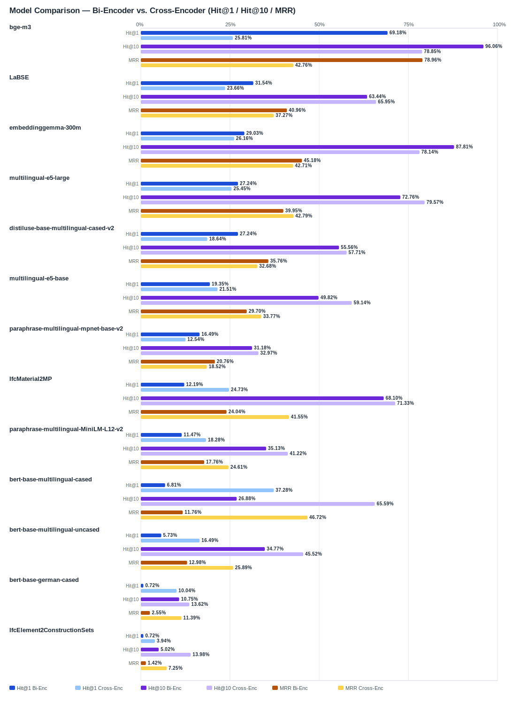

## Evaluation Report

Generated: 2026-03-01 19:24:14

### Inputs
- Summary CSV: `summary_ifcentity_material_strength_bge-reranker-v2-m3.csv`
- Details CSV: `details_ifcentity_material_strength_bge-reranker-v2-m3.csv`

### Overview

### Leaderboard

#### Baseline (Bi-Encoder)

| Rank | Model | Hit@1 | Hit@10 | Hit@20 | Hit@30 | Hit@50 | MRR@10 | MAP@10 | nDCG@10 | Recall@10 | Avg expected score | Hit@1 95% CI | Hit@10 95% CI | MRR@10 95% CI | nDCG@10 95% CI | Top1 errors |
|---:|---|---:|---:|---:|---:|---:|---:|---:|---:|---:|---:|---|---|---|---|---:|
| 1 | BAAI/bge-m3 | 69.18% | 96.06% | 100.00% | 100.00% | 100.00% | 0.790 | 0.760 | 0.813 | 0.931 | 0.645 | [0.638, 0.742] | [0.932, 0.982] | [0.746, 0.826] | [0.774, 0.849] | 86 |
| 2 | sentence-transformers/LaBSE | 31.54% | 63.44% | 72.04% | 82.80% | 89.96% | 0.410 | 0.356 | 0.428 | 0.575 | 0.492 | [0.256, 0.373] | [0.573, 0.690] | [0.356, 0.458] | [0.380, 0.473] | 191 |
| 3 | google/embeddinggemma-300m | 29.03% | 87.81% | 89.61% | 96.77% | 99.28% | 0.452 | 0.382 | 0.516 | 0.822 | 0.592 | [0.245, 0.355] | [0.844, 0.918] | [0.414, 0.503] | [0.487, 0.556] | 198 |
| 4 | intfloat/multilingual-e5-large | 27.24% | 72.76% | 88.17% | 94.98% | 96.06% | 0.400 | 0.362 | 0.439 | 0.610 | 0.851 | [0.219, 0.330] | [0.676, 0.785] | [0.352, 0.453] | [0.398, 0.487] | 203 |
| 5 | sentence-transformers/distiluse-base-multilingual-cased-v2 | 27.24% | 55.56% | 58.78% | 69.18% | 83.15% | 0.358 | 0.281 | 0.361 | 0.506 | 0.574 | [0.228, 0.330] | [0.498, 0.602] | [0.311, 0.410] | [0.321, 0.403] | 203 |
| 6 | intfloat/multilingual-e5-base | 19.35% | 49.82% | 65.95% | 74.91% | 81.36% | 0.297 | 0.250 | 0.294 | 0.371 | 0.857 | [0.145, 0.244] | [0.443, 0.561] | [0.251, 0.344] | [0.251, 0.344] | 225 |
| 7 | sentence-transformers/paraphrase-multilingual-mpnet-base-v2 | 16.49% | 31.18% | 41.58% | 50.90% | 80.29% | 0.208 | 0.109 | 0.145 | 0.156 | 0.568 | [0.125, 0.212] | [0.262, 0.369] | [0.168, 0.252] | [0.118, 0.176] | 233 |
| 8 | kforth/IfcMaterial2MP | 12.19% | 68.10% | 80.65% | 86.02% | 93.19% | 0.240 | 0.188 | 0.280 | 0.495 | 0.601 | [0.084, 0.161] | [0.620, 0.735] | [0.209, 0.275] | [0.250, 0.311] | 245 |
| 9 | sentence-transformers/paraphrase-multilingual-MiniLM-L12-v2 | 11.47% | 35.13% | 48.03% | 51.61% | 69.18% | 0.178 | 0.107 | 0.151 | 0.202 | 0.524 | [0.079, 0.147] | [0.296, 0.409] | [0.140, 0.217] | [0.121, 0.185] | 247 |
| 10 | google-bert/bert-base-multilingual-cased | 6.81% | 26.88% | 49.10% | 70.25% | 83.87% | 0.118 | 0.075 | 0.111 | 0.175 | 0.624 | [0.043, 0.100] | [0.224, 0.326] | [0.091, 0.151] | [0.089, 0.138] | 260 |
| 11 | google-bert/bert-base-multilingual-uncased | 5.73% | 34.77% | 54.48% | 63.44% | 80.65% | 0.130 | 0.072 | 0.116 | 0.177 | 0.686 | [0.032, 0.090] | [0.290, 0.409] | [0.101, 0.163] | [0.093, 0.146] | 263 |
| 12 | google-bert/bert-base-german-cased | 0.72% | 10.75% | 15.05% | 17.92% | 24.01% | 0.026 | 0.014 | 0.027 | 0.054 | 0.839 | [0.000, 0.018] | [0.075, 0.142] | [0.015, 0.038] | [0.018, 0.038] | 277 |
| 13 | kforth/IfcElement2ConstructionSets | 0.72% | 5.02% | 9.68% | 21.86% | 35.13% | 0.014 | 0.009 | 0.016 | 0.032 | 0.982 | [0.000, 0.018] | [0.029, 0.075] | [0.005, 0.026] | [0.007, 0.028] | 277 |

#### Reranked (Bi-Encoder + Cross-Encoder)

| Rank | Model | Cross-Encoder | Hit@1 | Hit@10 | Hit@20 | Hit@30 | Hit@50 | MRR@10 | MAP@10 | nDCG@10 | Recall@10 | Avg expected score | Hit@1 95% CI | Hit@10 95% CI | MRR@10 95% CI | nDCG@10 95% CI | Top1 errors |
|---:|---|---|---:|---:|---:|---:|---:|---:|---:|---:|---:|---:|---|---|---|---|---:|
| 1 | google-bert/bert-base-multilingual-cased | BAAI/bge-reranker-v2-m3 | 37.28% | 65.59% | 69.53% | 70.25% | 83.87% | 0.467 | 0.319 | 0.390 | 0.455 | 0.516 | [0.319, 0.430] | [0.600, 0.712] | [0.423, 0.521] | [0.352, 0.432] | 175 |
| 2 | google/embeddinggemma-300m | BAAI/bge-reranker-v2-m3 | 26.16% | 78.14% | 92.11% | 96.77% | 99.28% | 0.427 | 0.326 | 0.429 | 0.610 | 0.547 | [0.211, 0.308] | [0.735, 0.833] | [0.387, 0.469] | [0.393, 0.468] | 206 |
| 3 | BAAI/bge-m3 | BAAI/bge-reranker-v2-m3 | 25.81% | 78.85% | 95.34% | 100.00% | 100.00% | 0.428 | 0.331 | 0.434 | 0.621 | 0.547 | [0.211, 0.305] | [0.746, 0.841] | [0.385, 0.468] | [0.396, 0.471] | 207 |
| 4 | intfloat/multilingual-e5-large | BAAI/bge-reranker-v2-m3 | 25.45% | 79.57% | 88.53% | 94.98% | 96.06% | 0.428 | 0.331 | 0.435 | 0.628 | 0.547 | [0.206, 0.299] | [0.751, 0.846] | [0.389, 0.469] | [0.397, 0.473] | 208 |
| 5 | kforth/IfcMaterial2MP | BAAI/bge-reranker-v2-m3 | 24.73% | 71.33% | 82.80% | 86.02% | 93.19% | 0.416 | 0.322 | 0.403 | 0.535 | 0.546 | [0.197, 0.294] | [0.667, 0.765] | [0.373, 0.456] | [0.359, 0.444] | 210 |
| 6 | sentence-transformers/LaBSE | BAAI/bge-reranker-v2-m3 | 23.66% | 65.95% | 74.55% | 82.80% | 89.96% | 0.373 | 0.268 | 0.352 | 0.473 | 0.547 | [0.190, 0.281] | [0.609, 0.713] | [0.330, 0.417] | [0.313, 0.390] | 213 |
| 7 | intfloat/multilingual-e5-base | BAAI/bge-reranker-v2-m3 | 21.51% | 59.14% | 67.38% | 74.91% | 81.36% | 0.338 | 0.219 | 0.302 | 0.414 | 0.532 | [0.172, 0.272] | [0.543, 0.656] | [0.294, 0.390] | [0.274, 0.339] | 219 |
| 8 | sentence-transformers/distiluse-base-multilingual-cased-v2 | BAAI/bge-reranker-v2-m3 | 18.64% | 57.71% | 67.74% | 69.18% | 83.15% | 0.327 | 0.239 | 0.312 | 0.417 | 0.538 | [0.140, 0.229] | [0.520, 0.638] | [0.285, 0.369] | [0.274, 0.351] | 227 |
| 9 | sentence-transformers/paraphrase-multilingual-MiniLM-L12-v2 | BAAI/bge-reranker-v2-m3 | 18.28% | 41.22% | 48.75% | 51.61% | 69.18% | 0.246 | 0.154 | 0.208 | 0.273 | 0.519 | [0.145, 0.229] | [0.358, 0.473] | [0.209, 0.290] | [0.177, 0.242] | 228 |
| 10 | google-bert/bert-base-multilingual-uncased | BAAI/bge-reranker-v2-m3 | 16.49% | 45.52% | 60.57% | 63.44% | 80.65% | 0.259 | 0.150 | 0.208 | 0.270 | 0.532 | [0.122, 0.211] | [0.401, 0.509] | [0.218, 0.306] | [0.174, 0.243] | 233 |
| 11 | sentence-transformers/paraphrase-multilingual-mpnet-base-v2 | BAAI/bge-reranker-v2-m3 | 12.54% | 32.97% | 47.31% | 50.90% | 80.29% | 0.185 | 0.136 | 0.177 | 0.238 | 0.511 | [0.086, 0.168] | [0.276, 0.387] | [0.144, 0.227] | [0.144, 0.212] | 244 |
| 12 | google-bert/bert-base-german-cased | BAAI/bge-reranker-v2-m3 | 10.04% | 13.62% | 15.77% | 17.92% | 24.01% | 0.114 | 0.063 | 0.079 | 0.074 | 0.508 | [0.072, 0.134] | [0.100, 0.183] | [0.084, 0.152] | [0.057, 0.105] | 251 |
| 13 | kforth/IfcElement2ConstructionSets | BAAI/bge-reranker-v2-m3 | 3.94% | 13.98% | 16.49% | 21.86% | 35.13% | 0.072 | 0.024 | 0.040 | 0.047 | 0.508 | [0.018, 0.061] | [0.100, 0.178] | [0.047, 0.095] | [0.025, 0.056] | 268 |

Anzahl Queries: 279

### Hardest Queries (Baseline)
Queries mit den meisten Top1-Fehlern in der Baseline:

- (144 Fehler) IfcReinforcingBar Stahl B500B
- (142 Fehler) IfcBeam Beton C30/37
- (126 Fehler) IfcMember Stahl
- (103 Fehler) IfcWall Beton C30/37
- (90 Fehler) IfcMember Holz

### Hardest Queries (Reranked)
Queries mit den meisten Top1-Fehlern nach Re-Ranking:

- (141 Fehler) IfcMember Stahl
- (133 Fehler) IfcBeam Beton C30/37
- (108 Fehler) IfcMember Holz
- (91 Fehler) IfcPlate Stahl
- (84 Fehler) IfcReinforcingBar Stahl B500B
