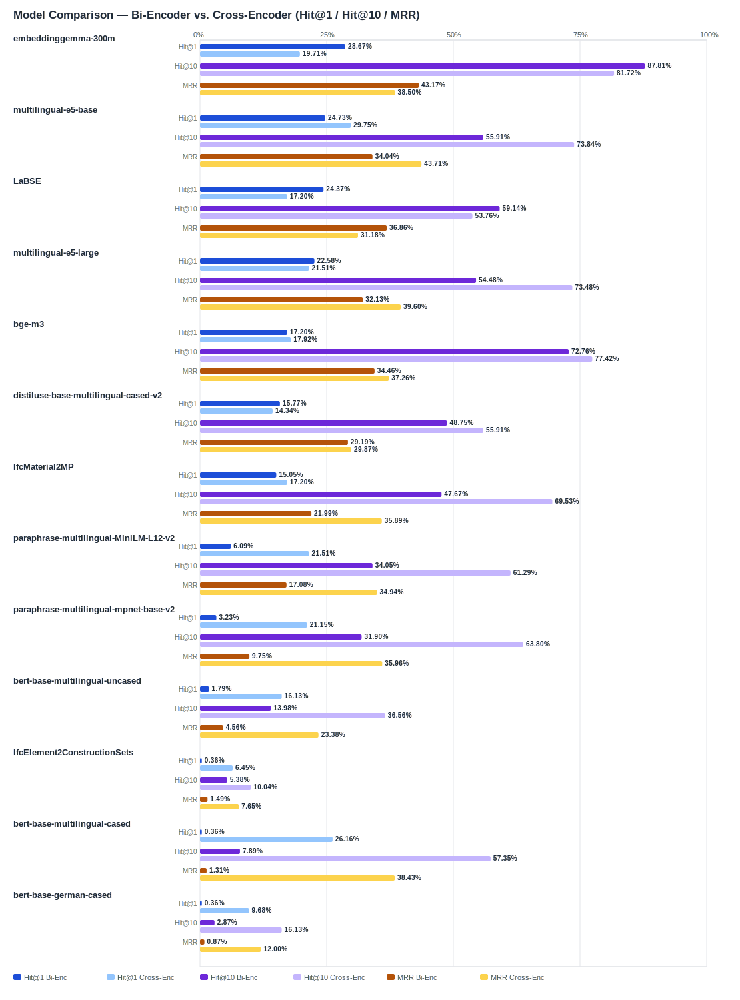

## Evaluation Report

Generated: 2026-03-01 10:30:22

### Inputs
- Summary CSV: `summary_key-value_ifcentity_material_bge-reranker-v2-m3.csv`
- Details CSV: `details_key-value_ifcentity_material_bge-reranker-v2-m3.csv`

### Overview

### Leaderboard

#### Baseline (Bi-Encoder)

| Rank | Model | Hit@1 | Hit@10 | Hit@20 | Hit@30 | Hit@50 | MRR@10 | MAP@10 | nDCG@10 | Recall@10 | Avg expected score | Hit@1 95% CI | Hit@10 95% CI | MRR@10 95% CI | nDCG@10 95% CI | Top1 errors |
|---:|---|---:|---:|---:|---:|---:|---:|---:|---:|---:|---:|---|---|---|---|---:|
| 1 | google/embeddinggemma-300m | 28.67% | 87.81% | 93.55% | 94.62% | 97.49% | 0.432 | 0.347 | 0.484 | 0.802 | 0.558 | [0.235, 0.348] | [0.840, 0.923] | [0.390, 0.482] | [0.450, 0.521] | 199 |
| 2 | intfloat/multilingual-e5-base | 24.73% | 55.91% | 73.12% | 81.00% | 89.25% | 0.340 | 0.306 | 0.359 | 0.460 | 0.845 | [0.195, 0.303] | [0.505, 0.616] | [0.290, 0.390] | [0.312, 0.407] | 210 |
| 3 | sentence-transformers/LaBSE | 24.37% | 59.14% | 67.03% | 68.10% | 71.68% | 0.369 | 0.315 | 0.386 | 0.524 | 0.377 | [0.190, 0.290] | [0.541, 0.647] | [0.324, 0.413] | [0.347, 0.428] | 211 |
| 4 | intfloat/multilingual-e5-large | 22.58% | 54.48% | 71.33% | 80.65% | 88.17% | 0.321 | 0.262 | 0.329 | 0.450 | 0.835 | [0.179, 0.276] | [0.491, 0.604] | [0.275, 0.372] | [0.288, 0.374] | 216 |
| 5 | BAAI/bge-m3 | 17.20% | 72.76% | 81.36% | 86.02% | 94.98% | 0.345 | 0.298 | 0.402 | 0.640 | 0.545 | [0.131, 0.217] | [0.681, 0.783] | [0.308, 0.384] | [0.371, 0.441] | 231 |
| 6 | sentence-transformers/distiluse-base-multilingual-cased-v2 | 15.77% | 48.75% | 62.01% | 63.44% | 79.93% | 0.292 | 0.272 | 0.334 | 0.454 | 0.386 | [0.120, 0.197] | [0.430, 0.543] | [0.254, 0.335] | [0.292, 0.376] | 235 |
| 7 | kforth/IfcMaterial2MP | 15.05% | 47.67% | 65.95% | 81.36% | 87.81% | 0.220 | 0.133 | 0.198 | 0.322 | 0.587 | [0.108, 0.194] | [0.419, 0.534] | [0.179, 0.258] | [0.167, 0.231] | 237 |
| 8 | sentence-transformers/paraphrase-multilingual-MiniLM-L12-v2 | 6.09% | 34.05% | 49.82% | 64.87% | 83.87% | 0.171 | 0.085 | 0.128 | 0.162 | 0.519 | [0.032, 0.090] | [0.292, 0.401] | [0.141, 0.210] | [0.103, 0.156] | 262 |
| 9 | sentence-transformers/paraphrase-multilingual-mpnet-base-v2 | 3.23% | 31.90% | 61.29% | 65.95% | 79.57% | 0.097 | 0.061 | 0.103 | 0.183 | 0.588 | [0.011, 0.054] | [0.263, 0.373] | [0.074, 0.123] | [0.078, 0.127] | 270 |
| 10 | google-bert/bert-base-multilingual-uncased | 1.79% | 13.98% | 22.58% | 36.92% | 59.14% | 0.046 | 0.019 | 0.037 | 0.056 | 0.624 | [0.004, 0.036] | [0.097, 0.181] | [0.027, 0.065] | [0.024, 0.051] | 274 |
| 11 | kforth/IfcElement2ConstructionSets | 0.36% | 5.38% | 6.45% | 13.98% | 25.09% | 0.015 | 0.004 | 0.009 | 0.012 | 0.983 | [0.000, 0.011] | [0.029, 0.086] | [0.007, 0.025] | [0.004, 0.015] | 278 |
| 12 | google-bert/bert-base-multilingual-cased | 0.36% | 7.89% | 44.09% | 65.23% | 91.40% | 0.013 | 0.008 | 0.020 | 0.054 | 0.584 | [0.000, 0.011] | [0.047, 0.113] | [0.007, 0.022] | [0.012, 0.028] | 278 |
| 13 | google-bert/bert-base-german-cased | 0.36% | 2.87% | 12.54% | 18.64% | 26.88% | 0.009 | 0.004 | 0.009 | 0.019 | 0.859 | [0.000, 0.011] | [0.011, 0.050] | [0.002, 0.019] | [0.004, 0.016] | 278 |

#### Reranked (Bi-Encoder + Cross-Encoder)

| Rank | Model | Cross-Encoder | Hit@1 | Hit@10 | Hit@20 | Hit@30 | Hit@50 | MRR@10 | MAP@10 | nDCG@10 | Recall@10 | Avg expected score | Hit@1 95% CI | Hit@10 95% CI | MRR@10 95% CI | nDCG@10 95% CI | Top1 errors |
|---:|---|---|---:|---:|---:|---:|---:|---:|---:|---:|---:|---:|---|---|---|---|---:|
| 1 | intfloat/multilingual-e5-base | BAAI/bge-reranker-v2-m3 | 29.75% | 73.84% | 78.49% | 81.00% | 89.25% | 0.437 | 0.355 | 0.458 | 0.657 | 0.526 | [0.244, 0.358] | [0.688, 0.790] | [0.389, 0.488] | [0.417, 0.501] | 196 |
| 2 | google-bert/bert-base-multilingual-cased | BAAI/bge-reranker-v2-m3 | 26.16% | 57.35% | 64.52% | 65.23% | 91.40% | 0.384 | 0.304 | 0.362 | 0.437 | 0.525 | [0.219, 0.319] | [0.518, 0.627] | [0.342, 0.438] | [0.321, 0.415] | 206 |
| 3 | intfloat/multilingual-e5-large | BAAI/bge-reranker-v2-m3 | 21.51% | 73.48% | 78.14% | 80.65% | 88.17% | 0.396 | 0.321 | 0.431 | 0.659 | 0.535 | [0.163, 0.269] | [0.685, 0.787] | [0.353, 0.439] | [0.393, 0.470] | 219 |
| 4 | sentence-transformers/paraphrase-multilingual-MiniLM-L12-v2 | BAAI/bge-reranker-v2-m3 | 21.51% | 61.29% | 63.80% | 64.87% | 83.87% | 0.349 | 0.243 | 0.326 | 0.443 | 0.516 | [0.167, 0.264] | [0.559, 0.669] | [0.310, 0.395] | [0.290, 0.364] | 219 |
| 5 | sentence-transformers/paraphrase-multilingual-mpnet-base-v2 | BAAI/bge-reranker-v2-m3 | 21.15% | 63.80% | 65.59% | 65.95% | 79.57% | 0.360 | 0.255 | 0.344 | 0.492 | 0.523 | [0.167, 0.272] | [0.586, 0.694] | [0.319, 0.408] | [0.311, 0.387] | 220 |
| 6 | google/embeddinggemma-300m | BAAI/bge-reranker-v2-m3 | 19.71% | 81.72% | 92.11% | 94.62% | 97.49% | 0.385 | 0.304 | 0.428 | 0.683 | 0.537 | [0.147, 0.244] | [0.778, 0.864] | [0.348, 0.428] | [0.396, 0.463] | 224 |
| 7 | BAAI/bge-m3 | BAAI/bge-reranker-v2-m3 | 17.92% | 77.42% | 83.87% | 86.02% | 94.98% | 0.373 | 0.315 | 0.433 | 0.688 | 0.537 | [0.133, 0.226] | [0.728, 0.826] | [0.333, 0.414] | [0.393, 0.469] | 229 |
| 8 | kforth/IfcMaterial2MP | BAAI/bge-reranker-v2-m3 | 17.20% | 69.53% | 79.93% | 81.36% | 87.81% | 0.359 | 0.267 | 0.368 | 0.548 | 0.536 | [0.131, 0.215] | [0.638, 0.746] | [0.316, 0.395] | [0.333, 0.400] | 231 |
| 9 | sentence-transformers/LaBSE | BAAI/bge-reranker-v2-m3 | 17.20% | 53.76% | 66.67% | 68.10% | 71.68% | 0.312 | 0.255 | 0.333 | 0.460 | 0.536 | [0.124, 0.219] | [0.480, 0.599] | [0.267, 0.360] | [0.289, 0.373] | 231 |
| 10 | google-bert/bert-base-multilingual-uncased | BAAI/bge-reranker-v2-m3 | 16.13% | 36.56% | 36.56% | 36.92% | 59.14% | 0.234 | 0.151 | 0.194 | 0.225 | 0.530 | [0.116, 0.210] | [0.308, 0.418] | [0.187, 0.279] | [0.154, 0.226] | 234 |
| 11 | sentence-transformers/distiluse-base-multilingual-cased-v2 | BAAI/bge-reranker-v2-m3 | 14.34% | 55.91% | 60.57% | 63.44% | 79.93% | 0.299 | 0.232 | 0.322 | 0.486 | 0.532 | [0.104, 0.185] | [0.498, 0.609] | [0.257, 0.340] | [0.284, 0.360] | 239 |
| 12 | google-bert/bert-base-german-cased | BAAI/bge-reranker-v2-m3 | 9.68% | 16.13% | 17.56% | 18.64% | 26.88% | 0.120 | 0.056 | 0.078 | 0.082 | 0.506 | [0.066, 0.133] | [0.122, 0.201] | [0.089, 0.154] | [0.055, 0.101] | 252 |
| 13 | kforth/IfcElement2ConstructionSets | BAAI/bge-reranker-v2-m3 | 6.45% | 10.04% | 11.11% | 13.98% | 25.09% | 0.076 | 0.040 | 0.054 | 0.055 | 0.508 | [0.036, 0.093] | [0.068, 0.136] | [0.049, 0.106] | [0.035, 0.076] | 261 |

Anzahl Queries: 279

### Hardest Queries (Baseline)
Queries mit den meisten Top1-Fehlern in der Baseline:

- (156 Fehler) Entity: IfcReinforcingBar Material: B500B
- (142 Fehler) Entity: IfcBeam Material: Beton
- (134 Fehler) Entity: IfcMember Material: Stahl
- (98 Fehler) Entity: IfcPile Material: Beton
- (90 Fehler) Entity: IfcMember Material: Holz

### Hardest Queries (Reranked)
Queries mit den meisten Top1-Fehlern nach Re-Ranking:

- (156 Fehler) Entity: IfcReinforcingBar Material: B500B
- (146 Fehler) Entity: IfcMember Material: Stahl
- (133 Fehler) Entity: IfcBeam Material: Beton
- (99 Fehler) Entity: IfcMember Material: Holz
- (84 Fehler) Entity: IfcPlate Material: Stahl
