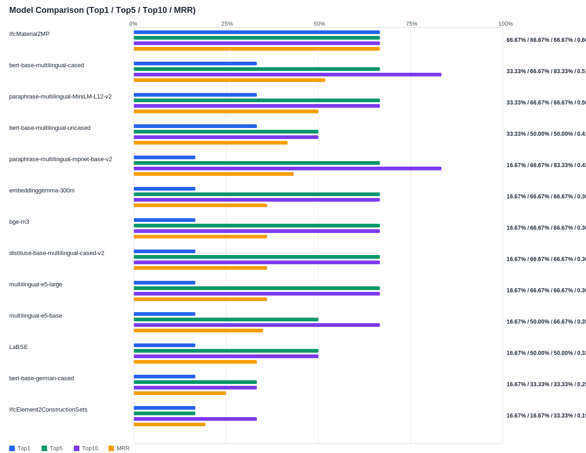

## Evaluation Report

Generated: 2026-02-26 17:10:34

### Inputs
- Summary CSV: `summary_list_1_queries_nur_material.csv`
- Details CSV: `details_list_1_queries_nur_material.csv`

### Overview

### Leaderboard

#### Baseline (Bi-Encoder)

| Rank | Model | Hit@1 | Hit@5 | Hit@10 | MRR@10 | MAP@10 | nDCG@10 | Recall@10 | Avg expected score | Hit@1 95% CI | Hit@10 95% CI | MRR@10 95% CI | nDCG@10 95% CI | Top1 errors |
|---:|---|---:|---:|---:|---:|---:|---:|---:|---:|---|---|---|---|---:|
| 1 | intfloat/multilingual-e5-large | 33.33% | 50.00% | 66.67% | 0.410 | 0.410 | 0.469 | 0.667 | 0.875 | [0.000, 0.667] | [0.333, 1.000] | [0.076, 0.778] | [0.136, 0.833] | 4 |
| 2 | sentence-transformers/distiluse-base-multilingual-cased-v2 | 16.67% | 66.67% | 66.67% | 0.347 | 0.347 | 0.427 | 0.667 | 0.700 | [0.000, 0.500] | [0.333, 1.000] | [0.097, 0.660] | [0.155, 0.744] | 5 |
| 3 | BAAI/bge-m3 | 16.67% | 66.67% | 66.67% | 0.347 | 0.347 | 0.427 | 0.667 | 0.646 | [0.000, 0.500] | [0.333, 1.000] | [0.097, 0.660] | [0.155, 0.744] | 5 |
| 4 | sentence-transformers/paraphrase-multilingual-mpnet-base-v2 | 16.67% | 33.33% | 50.00% | 0.274 | 0.274 | 0.327 | 0.500 | 0.742 | [0.000, 0.500] | [0.167, 0.833] | [0.024, 0.607] | [0.056, 0.664] | 5 |
| 5 | intfloat/multilingual-e5-base | 16.67% | 33.33% | 50.00% | 0.267 | 0.267 | 0.320 | 0.500 | 0.883 | [0.000, 0.500] | [0.167, 0.833] | [0.017, 0.600] | [0.048, 0.653] | 5 |
| 6 | kforth/IfcMaterial2MP | 16.67% | 50.00% | 50.00% | 0.264 | 0.264 | 0.322 | 0.500 | 0.691 | [0.000, 0.500] | [0.167, 0.833] | [0.042, 0.597] | [0.072, 0.655] | 5 |
| 7 | google/embeddinggemma-300m | 16.67% | 33.33% | 66.67% | 0.256 | 0.256 | 0.350 | 0.667 | 0.721 | [0.000, 0.500] | [0.333, 1.000] | [0.056, 0.586] | [0.119, 0.681] | 5 |
| 8 | google-bert/bert-base-german-cased | 16.67% | 33.33% | 33.33% | 0.250 | 0.250 | 0.272 | 0.333 | 0.864 | [0.000, 0.500] | [0.000, 0.667] | [0.000, 0.583] | [0.000, 0.605] | 5 |
| 9 | sentence-transformers/paraphrase-multilingual-MiniLM-L12-v2 | 16.67% | 33.33% | 50.00% | 0.224 | 0.224 | 0.287 | 0.500 | 0.788 | [0.000, 0.500] | [0.167, 0.833] | [0.024, 0.553] | [0.056, 0.616] | 5 |
| 10 | google-bert/bert-base-multilingual-cased | 16.67% | 33.33% | 33.33% | 0.222 | 0.222 | 0.250 | 0.333 | 0.707 | [0.000, 0.500] | [0.000, 0.833] | [0.000, 0.556] | [0.000, 0.583] | 5 |
| 11 | kforth/IfcElement2ConstructionSets | 16.67% | 16.67% | 33.33% | 0.190 | 0.190 | 0.222 | 0.333 | 0.990 | [0.000, 0.500] | [0.000, 0.667] | [0.000, 0.524] | [0.000, 0.556] | 5 |
| 12 | google-bert/bert-base-multilingual-uncased | 16.67% | 16.67% | 33.33% | 0.190 | 0.190 | 0.222 | 0.333 | 0.816 | [0.000, 0.500] | [0.000, 0.667] | [0.000, 0.524] | [0.000, 0.556] | 5 |
| 13 | sentence-transformers/LaBSE | 16.67% | 16.67% | 33.33% | 0.185 | 0.185 | 0.217 | 0.333 | 0.649 | [0.000, 0.500] | [0.000, 0.667] | [0.000, 0.519] | [0.000, 0.550] | 5 |

#### Reranked (Bi-Encoder + Cross-Encoder)

| Rank | Model | Cross-Encoder | Hit@1 | Hit@5 | Hit@10 | MRR@10 | MAP@10 | nDCG@10 | Recall@10 | Avg expected score | Hit@1 95% CI | Hit@10 95% CI | MRR@10 95% CI | nDCG@10 95% CI | Top1 errors |
|---:|---|---|---:|---:|---:|---:|---:|---:|---:|---:|---|---|---|---|---:|
| 1 | kforth/IfcMaterial2MP | BAAI/bge-reranker-v2-m3 | 66.67% | 66.67% | 66.67% | 0.667 | 0.667 | 0.667 | 0.667 | 0.580 | [0.333, 1.000] | [0.333, 1.000] | [0.333, 1.000] | [0.333, 1.000] | 2 |
| 2 | google-bert/bert-base-multilingual-cased | BAAI/bge-reranker-v2-m3 | 33.33% | 66.67% | 83.33% | 0.519 | 0.519 | 0.594 | 0.833 | 0.585 | [0.000, 0.667] | [0.500, 1.000] | [0.204, 0.833] | [0.288, 0.877] | 4 |
| 3 | sentence-transformers/paraphrase-multilingual-MiniLM-L12-v2 | BAAI/bge-reranker-v2-m3 | 33.33% | 66.67% | 66.67% | 0.500 | 0.500 | 0.544 | 0.667 | 0.583 | [0.000, 0.667] | [0.333, 1.000] | [0.167, 0.833] | [0.210, 0.877] | 4 |
| 4 | google-bert/bert-base-multilingual-uncased | BAAI/bge-reranker-v2-m3 | 33.33% | 50.00% | 50.00% | 0.417 | 0.417 | 0.438 | 0.500 | 0.595 | [0.000, 0.667] | [0.167, 0.833] | [0.083, 0.750] | [0.105, 0.795] | 4 |
| 5 | sentence-transformers/paraphrase-multilingual-mpnet-base-v2 | BAAI/bge-reranker-v2-m3 | 16.67% | 66.67% | 83.33% | 0.433 | 0.433 | 0.530 | 0.833 | 0.598 | [0.000, 0.500] | [0.500, 1.000] | [0.183, 0.750] | [0.258, 0.795] | 5 |
| 6 | google/embeddinggemma-300m | BAAI/bge-reranker-v2-m3 | 16.67% | 66.67% | 66.67% | 0.361 | 0.361 | 0.438 | 0.667 | 0.605 | [0.000, 0.500] | [0.333, 1.000] | [0.111, 0.681] | [0.167, 0.750] | 5 |
| 7 | BAAI/bge-m3 | BAAI/bge-reranker-v2-m3 | 16.67% | 66.67% | 66.67% | 0.361 | 0.361 | 0.438 | 0.667 | 0.605 | [0.000, 0.500] | [0.333, 1.000] | [0.111, 0.681] | [0.167, 0.750] | 5 |
| 8 | sentence-transformers/distiluse-base-multilingual-cased-v2 | BAAI/bge-reranker-v2-m3 | 16.67% | 66.67% | 66.67% | 0.361 | 0.361 | 0.438 | 0.667 | 0.602 | [0.000, 0.500] | [0.333, 1.000] | [0.111, 0.681] | [0.167, 0.750] | 5 |
| 9 | intfloat/multilingual-e5-large | BAAI/bge-reranker-v2-m3 | 16.67% | 66.67% | 66.67% | 0.361 | 0.361 | 0.438 | 0.667 | 0.601 | [0.000, 0.500] | [0.333, 1.000] | [0.111, 0.681] | [0.167, 0.750] | 5 |
| 10 | intfloat/multilingual-e5-base | BAAI/bge-reranker-v2-m3 | 16.67% | 50.00% | 66.67% | 0.350 | 0.350 | 0.425 | 0.667 | 0.598 | [0.000, 0.500] | [0.333, 1.000] | [0.091, 0.675] | [0.153, 0.756] | 5 |
| 11 | sentence-transformers/LaBSE | BAAI/bge-reranker-v2-m3 | 16.67% | 50.00% | 50.00% | 0.333 | 0.333 | 0.377 | 0.500 | 0.603 | [0.000, 0.500] | [0.167, 0.833] | [0.083, 0.667] | [0.105, 0.710] | 5 |
| 12 | google-bert/bert-base-german-cased | BAAI/bge-reranker-v2-m3 | 16.67% | 33.33% | 33.33% | 0.250 | 0.250 | 0.272 | 0.333 | 0.562 | [0.000, 0.500] | [0.000, 0.667] | [0.000, 0.583] | [0.000, 0.605] | 5 |
| 13 | kforth/IfcElement2ConstructionSets | BAAI/bge-reranker-v2-m3 | 16.67% | 16.67% | 33.33% | 0.194 | 0.194 | 0.226 | 0.333 | 0.597 | [0.000, 0.500] | [0.000, 0.667] | [0.000, 0.528] | [0.000, 0.559] | 5 |

Anzahl Queries: 6

### Hardest Queries (Baseline)
Queries mit den meisten Top1-Fehlern in der Baseline:

- (13 Fehler) B500B
- (13 Fehler) Beton
- (13 Fehler) Beton NPK F
- (13 Fehler) Flüssigkunststoff
- (12 Fehler) Beton NPK G

### Hardest Queries (Reranked)
Queries mit den meisten Top1-Fehlern nach Re-Ranking:

- (13 Fehler) B500B
- (13 Fehler) Flüssigkunststoff
- (12 Fehler) Beton NPK F
- (11 Fehler) Beton
- (10 Fehler) Beton NPK G
