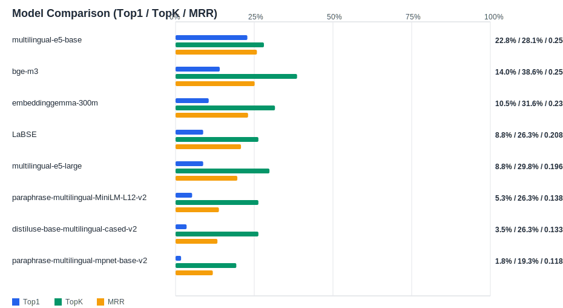

## Evaluation Report

Generated: 2026-02-20 18:20:13

### Inputs
- Summary CSV: `summary_20260220_180509.csv`
- Details CSV: `details_20260220_180509.csv`

### Metric Meaning
- Top1 Accuracy: Anteil Queries, bei denen das richtige Material auf Rang 1 steht.

  Formel: $\mathrm{Top1} = \frac{1}{N} \sum_{i=1}^{N} \mathbf{1}(\mathrm{Rang}_i = 1)$
Beispiel: 0.8 bedeutet 8 von 10 direkt korrekt.

- Top5 Accuracy: Anteil Queries, bei denen das richtige Material irgendwo in den Top 5 steht.

  Formel: $\mathrm{Top5} = \frac{1}{N} \sum_{i=1}^{N} \mathbf{1}(\mathrm{Rang}_i \leq 5)$

- MRR (Mean Reciprocal Rank): bewertet den Rang des richtigen Treffers (höher = besser).
  Formel: $\mathrm{MRR} = \frac{1}{N} \sum_{i=1}^{N} \frac{1}{\mathrm{Rang}_i}$

Dabei gilt: Rang 1 zählt voll, Rang 2 nur 0.5, Rang 3 nur 0.33, Rang 4: 0.25, Rang 5: 0.2 etc.
- Avg expected score: mittlerer Similarity-Score des korrekten Materials (nur als internes Vertrauenssignal pro Modell, nicht perfekt modellübergreifend vergleichbar).
- Die Score-Höhe allein ist nicht das wichtigste Kriterium; Ranking-Metriken (Top1/Top5/MRR) sind für Zuordnung robuster.

### Overview

### Leaderboard

| Rank | Model | Cases | Top1 | TopK | MRR | Avg expected score | Top1 errors |
|---:|---|---:|---:|---:|---:|---:|---:|
| 1 | intfloat/multilingual-e5-base | 57 | 22.8% | 28.1% | 0.258 | 0.816 | 44 |
| 2 | BAAI/bge-m3 | 57 | 14.0% | 38.6% | 0.251 | 0.492 | 49 |
| 3 | google/embeddinggemma-300m | 57 | 10.5% | 31.6% | 0.230 | 0.455 | 51 |
| 4 | sentence-transformers/LaBSE | 57 | 8.8% | 26.3% | 0.208 | 0.318 | 52 |
| 5 | intfloat/multilingual-e5-large | 57 | 8.8% | 29.8% | 0.196 | 0.828 | 52 |
| 6 | sentence-transformers/paraphrase-multilingual-MiniLM-L12-v2 | 57 | 5.3% | 26.3% | 0.138 | 0.255 | 54 |
| 7 | sentence-transformers/distiluse-base-multilingual-cased-v2 | 57 | 3.5% | 26.3% | 0.133 | 0.220 | 55 |
| 8 | sentence-transformers/paraphrase-multilingual-mpnet-base-v2 | 57 | 1.8% | 19.3% | 0.118 | 0.409 | 56 |

### Hardest Queries
Queries mit den meisten Top1-Fehlern über alle Modelle:

- (112 Fehler) IfcReinforcingBar 1. Lage aussen B500B
- (63 Fehler) IfcPile BORED Betonpfahl Beton Pfahlreihe Süd 800 Ortbeton
- (35 Fehler) IfcReinforcingBar Längsstab B500B
- (32 Fehler) IfcReinforcingBar Bügel B500B
- (16 Fehler) IfcReinforcingBar MAIN 1. Lage aussen B500B
