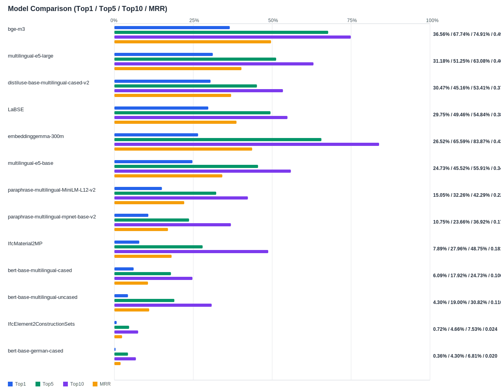

## Evaluation Report

Generated: 2026-02-26 15:23:25

### Inputs
- Summary CSV: `summary_list_1_queries_with_ifc.csv`
- Details CSV: `details_list_1_queries_with_ifc.csv`

### Overview

### Leaderboard

| Rank | Model | Hit@1 | Hit@5 | Hit@10 | MRR@10 | MAP@10 | nDCG@10 | Recall@10 | Avg expected score | Hit@1 95% CI | Hit@10 95% CI | MRR@10 95% CI | nDCG@10 95% CI | Top1 errors |
|---:|---|---:|---:|---:|---:|---:|---:|---:|---:|---|---|---|---|---:|
| 1 | BAAI/bge-m3 | 36.56% | 67.74% | 74.91% | 0.496 | 0.433 | 0.512 | 0.665 | 0.543 | [0.310, 0.425] | [0.695, 0.799] | [0.450, 0.544] | [0.464, 0.555] | 177 |
| 2 | intfloat/multilingual-e5-large | 31.18% | 51.25% | 63.08% | 0.403 | 0.352 | 0.417 | 0.549 | 0.851 | [0.262, 0.366] | [0.570, 0.688] | [0.356, 0.461] | [0.375, 0.472] | 192 |
| 3 | sentence-transformers/distiluse-base-multilingual-cased-v2 | 30.47% | 45.16% | 53.41% | 0.370 | 0.287 | 0.359 | 0.469 | 0.572 | [0.249, 0.366] | [0.475, 0.591] | [0.318, 0.424] | [0.314, 0.406] | 194 |
| 4 | sentence-transformers/LaBSE | 29.75% | 49.46% | 54.84% | 0.387 | 0.342 | 0.394 | 0.474 | 0.461 | [0.244, 0.353] | [0.486, 0.609] | [0.338, 0.437] | [0.347, 0.444] | 196 |
| 5 | google/embeddinggemma-300m | 26.52% | 65.59% | 83.87% | 0.437 | 0.372 | 0.495 | 0.770 | 0.585 | [0.215, 0.312] | [0.796, 0.885] | [0.397, 0.481] | [0.459, 0.535] | 205 |
| 6 | intfloat/multilingual-e5-base | 24.73% | 45.52% | 55.91% | 0.342 | 0.279 | 0.337 | 0.433 | 0.857 | [0.197, 0.301] | [0.505, 0.616] | [0.294, 0.395] | [0.296, 0.387] | 210 |
| 7 | sentence-transformers/paraphrase-multilingual-MiniLM-L12-v2 | 15.05% | 32.26% | 42.29% | 0.221 | 0.136 | 0.191 | 0.261 | 0.525 | [0.108, 0.188] | [0.371, 0.487] | [0.184, 0.266] | [0.160, 0.225] | 237 |
| 8 | sentence-transformers/paraphrase-multilingual-mpnet-base-v2 | 10.75% | 23.66% | 36.92% | 0.170 | 0.098 | 0.143 | 0.195 | 0.567 | [0.072, 0.151] | [0.317, 0.430] | [0.134, 0.217] | [0.115, 0.173] | 249 |
| 9 | kforth/IfcMaterial2MP | 7.89% | 27.96% | 48.75% | 0.181 | 0.118 | 0.186 | 0.316 | 0.582 | [0.047, 0.113] | [0.430, 0.552] | [0.146, 0.212] | [0.152, 0.213] | 257 |
| 10 | google-bert/bert-base-multilingual-cased | 6.09% | 17.92% | 24.73% | 0.106 | 0.068 | 0.102 | 0.163 | 0.621 | [0.032, 0.086] | [0.201, 0.301] | [0.076, 0.136] | [0.075, 0.129] | 262 |
| 11 | google-bert/bert-base-multilingual-uncased | 4.30% | 19.00% | 30.82% | 0.110 | 0.059 | 0.102 | 0.175 | 0.681 | [0.022, 0.068] | [0.251, 0.358] | [0.083, 0.139] | [0.080, 0.121] | 267 |
| 12 | kforth/IfcElement2ConstructionSets | 0.72% | 4.66% | 7.53% | 0.024 | 0.008 | 0.018 | 0.030 | 0.981 | [0.000, 0.018] | [0.047, 0.108] | [0.013, 0.038] | [0.010, 0.027] | 277 |
| 13 | google-bert/bert-base-german-cased | 0.36% | 4.30% | 6.81% | 0.020 | 0.013 | 0.024 | 0.045 | 0.829 | [0.000, 0.011] | [0.039, 0.093] | [0.010, 0.032] | [0.013, 0.036] | 278 |

Anzahl Queries: 279

### Hardest Queries
Queries mit den meisten Top1-Fehlern über alle Modelle:

- (13 Fehler) IfcBeam GIRDER_SEGMENT Randbord Beton NPK G Test-Kommentar Ortbeton
- (13 Fehler) IfcBeam EDGEBEAM Randbord Beton NPK G Randträger bewehrt Ortbeton
- (13 Fehler) IfcBeam PIERCAP Pfahlkopf Beton NPK G Pfahlkopf-Fundament Ortbeton
- (13 Fehler) IfcBeam CORNICE Beton
- (13 Fehler) IfcBeam DIAPHRAGM Beton
