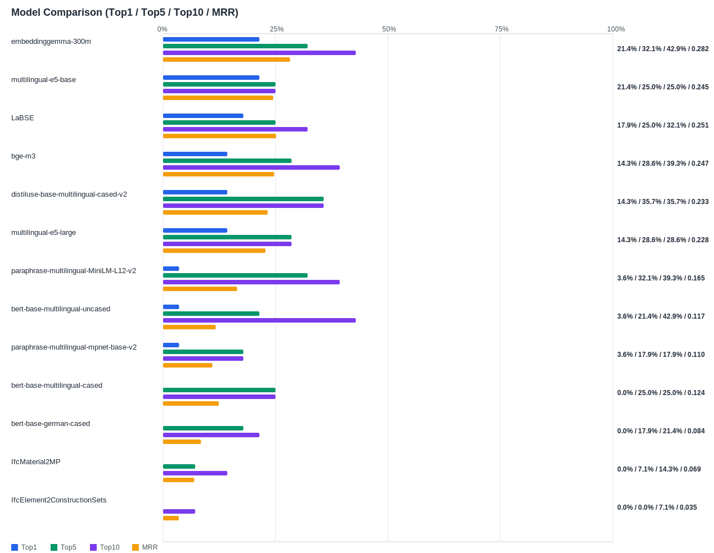

## Evaluation Report

Generated: 2026-02-26 15:39:54

### Inputs
- Summary CSV: `summary_list_1_queries_without_ifc.csv`
- Details CSV: `details_list_1_queries_without_ifc.csv`

### Overview

### Leaderboard

| Rank | Model | Hit@1 | Hit@5 | Hit@10 | MRR@10 | MAP@10 | nDCG@10 | Recall@10 | Avg expected score | Hit@1 95% CI | Hit@10 95% CI | MRR@10 95% CI | nDCG@10 95% CI | Top1 errors |
|---:|---|---:|---:|---:|---:|---:|---:|---:|---:|---|---|---|---|---:|
| 1 | BAAI/bge-m3 | 32.26% | 64.87% | 73.12% | 0.450 | 0.387 | 0.465 | 0.623 | 0.552 | [0.272, 0.380] | [0.676, 0.785] | [0.407, 0.496] | [0.422, 0.514] | 189 |
| 2 | google/embeddinggemma-300m | 31.54% | 69.18% | 85.30% | 0.469 | 0.400 | 0.518 | 0.780 | 0.595 | [0.262, 0.375] | [0.810, 0.896] | [0.428, 0.517] | [0.479, 0.562] | 191 |
| 3 | intfloat/multilingual-e5-large | 28.67% | 59.14% | 70.61% | 0.411 | 0.361 | 0.443 | 0.619 | 0.852 | [0.237, 0.344] | [0.654, 0.763] | [0.365, 0.468] | [0.402, 0.496] | 199 |
| 4 | sentence-transformers/LaBSE | 28.32% | 53.41% | 60.22% | 0.396 | 0.344 | 0.406 | 0.512 | 0.504 | [0.233, 0.337] | [0.538, 0.667] | [0.346, 0.453] | [0.359, 0.457] | 200 |
| 5 | sentence-transformers/distiluse-base-multilingual-cased-v2 | 26.16% | 51.25% | 58.42% | 0.366 | 0.284 | 0.364 | 0.503 | 0.582 | [0.219, 0.315] | [0.525, 0.638] | [0.319, 0.416] | [0.320, 0.409] | 206 |
| 6 | intfloat/multilingual-e5-base | 26.16% | 48.03% | 60.57% | 0.358 | 0.307 | 0.370 | 0.499 | 0.860 | [0.217, 0.319] | [0.550, 0.670] | [0.314, 0.411] | [0.325, 0.419] | 206 |
| 7 | sentence-transformers/paraphrase-multilingual-MiniLM-L12-v2 | 14.34% | 33.69% | 50.90% | 0.235 | 0.170 | 0.243 | 0.380 | 0.590 | [0.108, 0.183] | [0.450, 0.565] | [0.197, 0.277] | [0.210, 0.280] | 239 |
| 8 | google-bert/bert-base-multilingual-cased | 12.19% | 25.81% | 38.35% | 0.190 | 0.137 | 0.185 | 0.277 | 0.610 | [0.086, 0.158] | [0.335, 0.448] | [0.153, 0.228] | [0.151, 0.219] | 245 |
| 9 | kforth/IfcMaterial2MP | 11.11% | 43.37% | 61.29% | 0.249 | 0.174 | 0.256 | 0.416 | 0.597 | [0.075, 0.154] | [0.559, 0.672] | [0.211, 0.290] | [0.222, 0.290] | 248 |
| 10 | google-bert/bert-base-multilingual-uncased | 10.39% | 32.97% | 48.39% | 0.192 | 0.130 | 0.197 | 0.329 | 0.703 | [0.070, 0.142] | [0.427, 0.541] | [0.157, 0.229] | [0.164, 0.228] | 250 |
| 11 | sentence-transformers/paraphrase-multilingual-mpnet-base-v2 | 4.66% | 20.43% | 40.50% | 0.125 | 0.096 | 0.155 | 0.290 | 0.645 | [0.022, 0.072] | [0.348, 0.464] | [0.101, 0.152] | [0.130, 0.185] | 266 |
| 12 | google-bert/bert-base-german-cased | 0.36% | 5.73% | 7.89% | 0.022 | 0.016 | 0.028 | 0.053 | 0.842 | [0.000, 0.011] | [0.050, 0.111] | [0.013, 0.034] | [0.017, 0.041] | 278 |
| 13 | kforth/IfcElement2ConstructionSets | 0.00% | 3.23% | 6.81% | 0.016 | 0.008 | 0.017 | 0.031 | 0.980 | [0.000, 0.000] | [0.043, 0.102] | [0.008, 0.025] | [0.009, 0.026] | 279 |

Anzahl Queries: 279

### Hardest Queries
Queries mit den meisten Top1-Fehlern über alle Modelle:

- (13 Fehler) Beam GIRDER_SEGMENT Randbord Beton NPK G Test-Kommentar Ortbeton
- (13 Fehler) Beam EDGEBEAM Randbord Beton NPK G Randträger bewehrt Ortbeton
- (13 Fehler) Beam PIERCAP Pfahlkopf Beton NPK G Pfahlkopf-Fundament Ortbeton
- (13 Fehler) Beam BEAM Beton
- (13 Fehler) Beam CORNICE Beton
