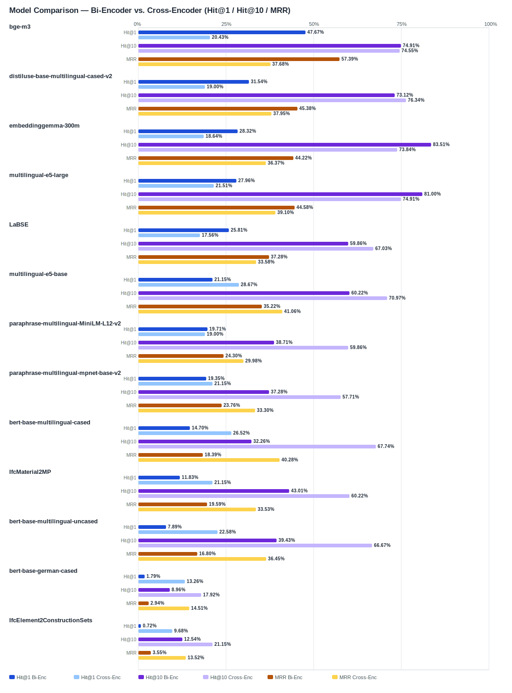

## Evaluation Report

Generated: 2026-03-01 08:52:40

### Inputs
- Summary CSV: `summary_material_ifcentity_bge-reranker-v2-m3.csv`
- Details CSV: `details_material_ifcentity_bge-reranker-v2-m3.csv`

### Overview

### Leaderboard

#### Baseline (Bi-Encoder)

| Rank | Model | Hit@1 | Hit@10 | Hit@20 | Hit@30 | Hit@50 | MRR@10 | MAP@10 | nDCG@10 | Recall@10 | Avg expected score | Hit@1 95% CI | Hit@10 95% CI | MRR@10 95% CI | nDCG@10 95% CI | Top1 errors |
|---:|---|---:|---:|---:|---:|---:|---:|---:|---:|---:|---:|---|---|---|---|---:|
| 1 | BAAI/bge-m3 | 47.67% | 74.91% | 86.38% | 89.25% | 94.62% | 0.574 | 0.507 | 0.569 | 0.671 | 0.546 | [0.427, 0.534] | [0.701, 0.799] | [0.529, 0.627] | [0.529, 0.619] | 146 |
| 2 | sentence-transformers/distiluse-base-multilingual-cased-v2 | 31.54% | 73.12% | 82.44% | 84.95% | 91.40% | 0.454 | 0.370 | 0.464 | 0.634 | 0.685 | [0.271, 0.366] | [0.683, 0.780] | [0.411, 0.502] | [0.424, 0.506] | 191 |
| 3 | google/embeddinggemma-300m | 28.32% | 83.51% | 87.10% | 92.47% | 98.92% | 0.442 | 0.395 | 0.509 | 0.773 | 0.619 | [0.237, 0.339] | [0.788, 0.882] | [0.407, 0.493] | [0.474, 0.552] | 200 |
| 4 | intfloat/multilingual-e5-large | 27.96% | 81.00% | 85.66% | 89.25% | 91.04% | 0.446 | 0.408 | 0.497 | 0.699 | 0.856 | [0.233, 0.333] | [0.765, 0.859] | [0.407, 0.495] | [0.460, 0.541] | 201 |
| 5 | sentence-transformers/LaBSE | 25.81% | 59.86% | 73.84% | 83.15% | 89.25% | 0.373 | 0.338 | 0.402 | 0.528 | 0.544 | [0.206, 0.315] | [0.538, 0.656] | [0.324, 0.422] | [0.357, 0.448] | 207 |
| 6 | intfloat/multilingual-e5-base | 21.15% | 60.22% | 78.49% | 85.66% | 88.89% | 0.352 | 0.299 | 0.358 | 0.471 | 0.863 | [0.167, 0.262] | [0.548, 0.661] | [0.310, 0.397] | [0.319, 0.404] | 220 |
| 7 | sentence-transformers/paraphrase-multilingual-MiniLM-L12-v2 | 19.71% | 38.71% | 53.05% | 66.31% | 85.66% | 0.243 | 0.140 | 0.184 | 0.211 | 0.511 | [0.149, 0.244] | [0.342, 0.452] | [0.200, 0.290] | [0.153, 0.217] | 224 |
| 8 | sentence-transformers/paraphrase-multilingual-mpnet-base-v2 | 19.35% | 37.28% | 58.42% | 69.89% | 83.15% | 0.238 | 0.122 | 0.169 | 0.199 | 0.563 | [0.151, 0.240] | [0.319, 0.436] | [0.197, 0.284] | [0.141, 0.201] | 225 |
| 9 | google-bert/bert-base-multilingual-cased | 14.70% | 32.26% | 47.31% | 73.84% | 90.32% | 0.184 | 0.125 | 0.161 | 0.217 | 0.626 | [0.108, 0.195] | [0.278, 0.380] | [0.148, 0.230] | [0.132, 0.197] | 238 |
| 10 | kforth/IfcMaterial2MP | 11.83% | 43.01% | 65.23% | 73.12% | 84.59% | 0.196 | 0.136 | 0.193 | 0.294 | 0.605 | [0.081, 0.156] | [0.371, 0.489] | [0.156, 0.235] | [0.160, 0.226] | 246 |
| 11 | google-bert/bert-base-multilingual-uncased | 7.89% | 39.43% | 68.10% | 76.34% | 85.30% | 0.168 | 0.121 | 0.174 | 0.276 | 0.697 | [0.050, 0.109] | [0.348, 0.450] | [0.140, 0.201] | [0.147, 0.204] | 257 |
| 12 | google-bert/bert-base-german-cased | 1.79% | 8.96% | 16.85% | 20.07% | 26.88% | 0.029 | 0.016 | 0.027 | 0.043 | 0.836 | [0.004, 0.032] | [0.057, 0.125] | [0.016, 0.045] | [0.016, 0.040] | 274 |
| 13 | kforth/IfcElement2ConstructionSets | 0.72% | 12.54% | 19.35% | 24.37% | 44.80% | 0.036 | 0.016 | 0.030 | 0.047 | 0.980 | [0.000, 0.018] | [0.082, 0.168] | [0.020, 0.051] | [0.017, 0.043] | 277 |

#### Reranked (Bi-Encoder + Cross-Encoder)

| Rank | Model | Cross-Encoder | Hit@1 | Hit@10 | Hit@20 | Hit@30 | Hit@50 | MRR@10 | MAP@10 | nDCG@10 | Recall@10 | Avg expected score | Hit@1 95% CI | Hit@10 95% CI | MRR@10 95% CI | nDCG@10 95% CI | Top1 errors |
|---:|---|---|---:|---:|---:|---:|---:|---:|---:|---:|---:|---:|---|---|---|---|---:|
| 1 | intfloat/multilingual-e5-base | BAAI/bge-reranker-v2-m3 | 28.67% | 70.97% | 82.08% | 85.66% | 88.89% | 0.411 | 0.266 | 0.368 | 0.527 | 0.527 | [0.240, 0.342] | [0.663, 0.763] | [0.368, 0.459] | [0.340, 0.409] | 199 |
| 2 | google-bert/bert-base-multilingual-cased | BAAI/bge-reranker-v2-m3 | 26.52% | 67.74% | 73.12% | 73.84% | 90.32% | 0.403 | 0.266 | 0.354 | 0.478 | 0.515 | [0.219, 0.321] | [0.624, 0.731] | [0.361, 0.451] | [0.324, 0.394] | 205 |
| 3 | google-bert/bert-base-multilingual-uncased | BAAI/bge-reranker-v2-m3 | 22.58% | 66.67% | 74.19% | 76.34% | 85.30% | 0.365 | 0.232 | 0.323 | 0.463 | 0.530 | [0.179, 0.281] | [0.613, 0.720] | [0.326, 0.414] | [0.291, 0.361] | 216 |
| 4 | intfloat/multilingual-e5-large | BAAI/bge-reranker-v2-m3 | 21.51% | 74.91% | 86.38% | 89.25% | 91.04% | 0.391 | 0.279 | 0.384 | 0.566 | 0.531 | [0.163, 0.262] | [0.703, 0.799] | [0.351, 0.433] | [0.349, 0.420] | 219 |
| 5 | kforth/IfcMaterial2MP | BAAI/bge-reranker-v2-m3 | 21.15% | 60.22% | 70.61% | 73.12% | 84.59% | 0.335 | 0.205 | 0.284 | 0.388 | 0.524 | [0.168, 0.258] | [0.552, 0.658] | [0.295, 0.382] | [0.252, 0.320] | 220 |
| 6 | sentence-transformers/paraphrase-multilingual-mpnet-base-v2 | BAAI/bge-reranker-v2-m3 | 21.15% | 57.71% | 68.10% | 69.89% | 83.15% | 0.333 | 0.253 | 0.329 | 0.462 | 0.522 | [0.161, 0.269] | [0.529, 0.631] | [0.290, 0.385] | [0.296, 0.374] | 220 |
| 7 | BAAI/bge-m3 | BAAI/bge-reranker-v2-m3 | 20.43% | 74.55% | 83.87% | 89.25% | 94.62% | 0.377 | 0.265 | 0.370 | 0.554 | 0.531 | [0.156, 0.251] | [0.701, 0.796] | [0.337, 0.421] | [0.342, 0.404] | 222 |
| 8 | sentence-transformers/distiluse-base-multilingual-cased-v2 | BAAI/bge-reranker-v2-m3 | 19.00% | 76.34% | 81.72% | 84.95% | 91.40% | 0.380 | 0.268 | 0.381 | 0.580 | 0.530 | [0.145, 0.237] | [0.720, 0.814] | [0.345, 0.420] | [0.353, 0.416] | 226 |
| 9 | sentence-transformers/paraphrase-multilingual-MiniLM-L12-v2 | BAAI/bge-reranker-v2-m3 | 19.00% | 59.86% | 63.80% | 66.31% | 85.66% | 0.300 | 0.196 | 0.277 | 0.410 | 0.517 | [0.154, 0.237] | [0.550, 0.658] | [0.265, 0.345] | [0.247, 0.313] | 226 |
| 10 | google/embeddinggemma-300m | BAAI/bge-reranker-v2-m3 | 18.64% | 73.84% | 89.96% | 92.47% | 98.92% | 0.364 | 0.265 | 0.368 | 0.557 | 0.531 | [0.143, 0.233] | [0.692, 0.792] | [0.327, 0.405] | [0.338, 0.404] | 227 |
| 11 | sentence-transformers/LaBSE | BAAI/bge-reranker-v2-m3 | 17.56% | 67.03% | 77.42% | 83.15% | 89.25% | 0.336 | 0.245 | 0.337 | 0.496 | 0.531 | [0.129, 0.221] | [0.618, 0.724] | [0.295, 0.381] | [0.302, 0.374] | 230 |
| 12 | google-bert/bert-base-german-cased | BAAI/bge-reranker-v2-m3 | 13.26% | 17.92% | 20.07% | 20.07% | 26.88% | 0.145 | 0.077 | 0.100 | 0.102 | 0.509 | [0.097, 0.174] | [0.140, 0.224] | [0.110, 0.186] | [0.077, 0.127] | 242 |
| 13 | kforth/IfcElement2ConstructionSets | BAAI/bge-reranker-v2-m3 | 9.68% | 21.15% | 24.37% | 24.37% | 44.80% | 0.135 | 0.071 | 0.096 | 0.105 | 0.513 | [0.068, 0.127] | [0.165, 0.262] | [0.100, 0.169] | [0.069, 0.121] | 252 |

Anzahl Queries: 279

### Hardest Queries (Baseline)
Queries mit den meisten Top1-Fehlern in der Baseline:

- (112 Fehler) Beton IfcBeam
- (112 Fehler) Stahl IfcMember
- (108 Fehler) Holz IfcMember
- (104 Fehler) Beton IfcPile
- (96 Fehler) Beton IfcWall

### Hardest Queries (Reranked)
Queries mit den meisten Top1-Fehlern nach Re-Ranking:

- (133 Fehler) Stahl IfcMember
- (123 Fehler) Beton IfcBeam
- (108 Fehler) Holz IfcMember
- (91 Fehler) Stahl IfcPlate
- (80 Fehler) Beton IfcPile
