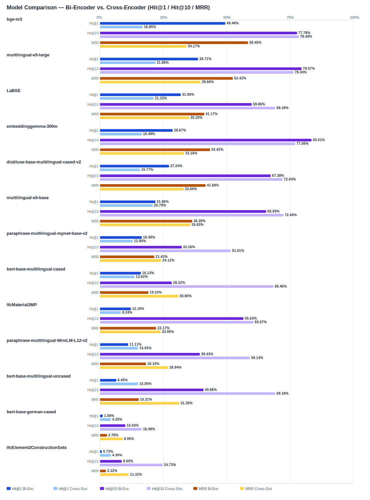

## Evaluation Report

Generated: 2026-02-28 20:10:18

### Inputs
- Summary CSV: `summary.csv`
- Details CSV: `details.csv`

### Overview

### Leaderboard

#### Baseline (Bi-Encoder)

| Rank | Model | Hit@1 | Hit@10 | Hit@20 | Hit@30 | Hit@50 | MRR@10 | MAP@10 | nDCG@10 | Recall@10 | Avg expected score | Hit@1 95% CI | Hit@10 95% CI | MRR@10 95% CI | nDCG@10 95% CI | Top1 errors |
|---:|---|---:|---:|---:|---:|---:|---:|---:|---:|---:|---:|---|---|---|---|---:|
| 1 | BAAI/bge-m3 | 49.46% | 77.78% | 84.95% | 89.61% | 91.76% | 0.584 | 0.515 | 0.580 | 0.688 | 0.552 | [0.444, 0.552] | [0.731, 0.828] | [0.542, 0.635] | [0.539, 0.627] | 141 |
| 2 | intfloat/multilingual-e5-large | 38.71% | 79.57% | 86.74% | 89.61% | 92.11% | 0.524 | 0.472 | 0.549 | 0.701 | 0.860 | [0.337, 0.444] | [0.749, 0.842] | [0.480, 0.570] | [0.510, 0.594] | 171 |
| 3 | sentence-transformers/LaBSE | 31.90% | 59.86% | 73.48% | 83.87% | 90.32% | 0.412 | 0.353 | 0.418 | 0.535 | 0.544 | [0.258, 0.375] | [0.541, 0.656] | [0.358, 0.464] | [0.370, 0.465] | 190 |
| 4 | google/embeddinggemma-300m | 28.67% | 83.51% | 84.59% | 92.83% | 98.57% | 0.434 | 0.368 | 0.495 | 0.780 | 0.624 | [0.240, 0.348] | [0.792, 0.880] | [0.400, 0.485] | [0.465, 0.536] | 199 |
| 5 | sentence-transformers/distiluse-base-multilingual-cased-v2 | 27.24% | 67.38% | 81.36% | 84.95% | 91.04% | 0.417 | 0.332 | 0.426 | 0.597 | 0.662 | [0.228, 0.330] | [0.616, 0.728] | [0.374, 0.467] | [0.390, 0.466] | 203 |
| 6 | intfloat/multilingual-e5-base | 21.86% | 65.59% | 78.85% | 84.23% | 88.17% | 0.364 | 0.303 | 0.374 | 0.523 | 0.864 | [0.174, 0.267] | [0.609, 0.710] | [0.319, 0.407] | [0.337, 0.416] | 218 |
| 7 | sentence-transformers/paraphrase-multilingual-mpnet-base-v2 | 16.49% | 32.26% | 45.88% | 59.14% | 74.91% | 0.214 | 0.114 | 0.153 | 0.167 | 0.564 | [0.125, 0.212] | [0.276, 0.384] | [0.177, 0.258] | [0.127, 0.187] | 233 |
| 8 | google-bert/bert-base-multilingual-cased | 16.13% | 28.32% | 51.25% | 75.27% | 87.46% | 0.191 | 0.132 | 0.160 | 0.187 | 0.644 | [0.122, 0.206] | [0.238, 0.342] | [0.154, 0.236] | [0.130, 0.196] | 234 |
| 9 | kforth/IfcMaterial2MP | 12.19% | 56.63% | 68.82% | 72.04% | 82.80% | 0.222 | 0.161 | 0.230 | 0.361 | 0.603 | [0.086, 0.158] | [0.511, 0.624] | [0.185, 0.260] | [0.198, 0.262] | 245 |
| 10 | sentence-transformers/paraphrase-multilingual-MiniLM-L12-v2 | 11.11% | 39.43% | 57.35% | 67.74% | 83.51% | 0.182 | 0.110 | 0.159 | 0.222 | 0.526 | [0.075, 0.143] | [0.344, 0.455] | [0.150, 0.220] | [0.132, 0.191] | 248 |
| 11 | google-bert/bert-base-multilingual-uncased | 6.45% | 40.86% | 66.31% | 78.85% | 87.10% | 0.153 | 0.097 | 0.153 | 0.248 | 0.708 | [0.039, 0.095] | [0.353, 0.462] | [0.123, 0.185] | [0.127, 0.178] | 261 |
| 12 | google-bert/bert-base-german-cased | 1.08% | 10.04% | 17.56% | 20.07% | 26.16% | 0.028 | 0.016 | 0.027 | 0.046 | 0.831 | [0.000, 0.025] | [0.068, 0.136] | [0.015, 0.042] | [0.016, 0.038] | 276 |
| 13 | kforth/IfcElement2ConstructionSets | 0.72% | 8.60% | 13.26% | 24.73% | 41.94% | 0.023 | 0.016 | 0.028 | 0.053 | 0.982 | [0.000, 0.018] | [0.057, 0.115] | [0.013, 0.035] | [0.016, 0.041] | 277 |

#### Reranked (Bi-Encoder + Cross-Encoder)

| Rank | Model | Cross-Encoder | Hit@1 | Hit@10 | Hit@20 | Hit@30 | Hit@50 | MRR@10 | MAP@10 | nDCG@10 | Recall@10 | Avg expected score | Hit@1 95% CI | Hit@10 95% CI | MRR@10 95% CI | nDCG@10 95% CI | Top1 errors |
|---:|---|---|---:|---:|---:|---:|---:|---:|---:|---:|---:|---:|---|---|---|---|---:|
| 1 | intfloat/multilingual-e5-large | Alibaba-NLP/gte-multilingual-reranker-base | 21.86% | 76.34% | 88.17% | 89.61% | 92.11% | 0.397 | 0.339 | 0.446 | 0.673 | 0.618 | [0.176, 0.272] | [0.715, 0.810] | [0.353, 0.441] | [0.408, 0.485] | 218 |
| 2 | sentence-transformers/LaBSE | Alibaba-NLP/gte-multilingual-reranker-base | 21.15% | 69.18% | 80.29% | 83.87% | 90.32% | 0.352 | 0.279 | 0.379 | 0.582 | 0.619 | [0.165, 0.260] | [0.636, 0.747] | [0.306, 0.397] | [0.342, 0.418] | 220 |
| 3 | intfloat/multilingual-e5-base | Alibaba-NLP/gte-multilingual-reranker-base | 20.79% | 72.40% | 81.00% | 84.23% | 88.17% | 0.356 | 0.287 | 0.392 | 0.608 | 0.618 | [0.161, 0.258] | [0.670, 0.774] | [0.310, 0.406] | [0.355, 0.431] | 221 |
| 4 | BAAI/bge-m3 | Alibaba-NLP/gte-multilingual-reranker-base | 16.85% | 78.49% | 85.66% | 89.61% | 91.76% | 0.342 | 0.281 | 0.401 | 0.671 | 0.620 | [0.125, 0.219] | [0.738, 0.830] | [0.301, 0.384] | [0.367, 0.441] | 232 |
| 5 | google/embeddinggemma-300m | Alibaba-NLP/gte-multilingual-reranker-base | 16.49% | 77.06% | 86.38% | 92.83% | 98.57% | 0.332 | 0.283 | 0.401 | 0.671 | 0.620 | [0.122, 0.211] | [0.717, 0.823] | [0.291, 0.371] | [0.366, 0.436] | 233 |
| 6 | sentence-transformers/distiluse-base-multilingual-cased-v2 | Alibaba-NLP/gte-multilingual-reranker-base | 15.77% | 72.04% | 84.95% | 84.95% | 91.04% | 0.330 | 0.269 | 0.373 | 0.586 | 0.620 | [0.116, 0.203] | [0.670, 0.763] | [0.292, 0.369] | [0.337, 0.408] | 235 |
| 7 | google-bert/bert-base-multilingual-uncased | Alibaba-NLP/gte-multilingual-reranker-base | 15.05% | 69.18% | 76.34% | 78.85% | 87.10% | 0.313 | 0.242 | 0.337 | 0.533 | 0.618 | [0.111, 0.190] | [0.642, 0.746] | [0.273, 0.349] | [0.304, 0.371] | 237 |
| 8 | sentence-transformers/paraphrase-multilingual-MiniLM-L12-v2 | Alibaba-NLP/gte-multilingual-reranker-base | 15.05% | 59.14% | 67.38% | 67.74% | 83.51% | 0.269 | 0.193 | 0.279 | 0.441 | 0.620 | [0.111, 0.199] | [0.532, 0.652] | [0.231, 0.313] | [0.243, 0.315] | 237 |
| 9 | google-bert/bert-base-multilingual-cased | Alibaba-NLP/gte-multilingual-reranker-base | 13.62% | 68.46% | 74.55% | 75.27% | 87.46% | 0.309 | 0.221 | 0.319 | 0.517 | 0.618 | [0.100, 0.178] | [0.631, 0.735] | [0.272, 0.344] | [0.285, 0.351] | 241 |
| 10 | sentence-transformers/paraphrase-multilingual-mpnet-base-v2 | Alibaba-NLP/gte-multilingual-reranker-base | 12.90% | 51.61% | 58.78% | 59.14% | 74.91% | 0.241 | 0.180 | 0.249 | 0.374 | 0.618 | [0.091, 0.174] | [0.466, 0.586] | [0.207, 0.287] | [0.217, 0.292] | 243 |
| 11 | kforth/IfcMaterial2MP | Alibaba-NLP/gte-multilingual-reranker-base | 8.24% | 60.57% | 70.97% | 72.04% | 82.80% | 0.239 | 0.186 | 0.280 | 0.475 | 0.617 | [0.050, 0.120] | [0.554, 0.661] | [0.209, 0.271] | [0.248, 0.314] | 256 |
| 12 | kforth/IfcElement2ConstructionSets | Alibaba-NLP/gte-multilingual-reranker-base | 4.30% | 24.73% | 24.73% | 24.73% | 41.94% | 0.113 | 0.044 | 0.077 | 0.107 | 0.614 | [0.018, 0.068] | [0.201, 0.287] | [0.086, 0.140] | [0.060, 0.094] | 267 |
| 13 | google-bert/bert-base-german-cased | Alibaba-NLP/gte-multilingual-reranker-base | 4.30% | 16.49% | 19.71% | 20.07% | 26.16% | 0.090 | 0.042 | 0.066 | 0.088 | 0.615 | [0.018, 0.068] | [0.125, 0.210] | [0.064, 0.116] | [0.047, 0.086] | 267 |

Anzahl Queries: 279

### Hardest Queries (Baseline)
Queries mit den meisten Top1-Fehlern in der Baseline:

- (126 Fehler) IfcMember Stahl
- (122 Fehler) IfcBeam Beton
- (99 Fehler) IfcMember Holz
- (98 Fehler) IfcPile Beton
- (88 Fehler) IfcWall Beton

### Hardest Queries (Reranked)
Queries mit den meisten Top1-Fehlern nach Re-Ranking:

- (189 Fehler) IfcMember Stahl
- (96 Fehler) IfcWall Beton
- (91 Fehler) IfcPlate Stahl
- (91 Fehler) IfcTrackElement Stahl
- (85 Fehler) IfcWall Stahlbeton
