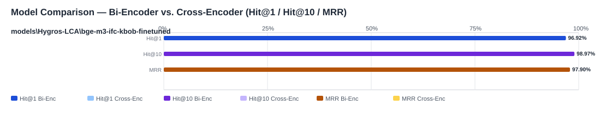

## Evaluation Report

Generated: 2026-05-19 09:59:06

### Inputs
- Summary CSV: `summary_eval-bge-m3-ifc-kbob-finetuned_bge-m3-ifc-kbob-finetuned-c0c6a47a_queries-b9bc9eb9_no-reranker-7521044b.csv`
- Details CSV: `details_eval-bge-m3-ifc-kbob-finetuned_bge-m3-ifc-kbob-finetuned-c0c6a47a_queries-b9bc9eb9_no-reranker-7521044b.csv`

### Overview

### Leaderboard

#### Baseline (Bi-Encoder)

| Rank | Model | Hit@1 | Hit@10 | Hit@20 | Hit@30 | Hit@50 | MRR@10 | MAP@10 | nDCG@10 | Recall@10 | Avg expected score | Hit@1 95% CI | Hit@10 95% CI | MRR@10 95% CI | nDCG@10 95% CI | Top1 errors |
|---:|---|---:|---:|---:|---:|---:|---:|---:|---:|---:|---:|---|---|---|---|---:|
| 1 | models\Hygros-LCA\bge-m3-ifc-kbob-finetuned | 96.92% | 98.97% | 98.97% | 99.74% | 100.00% | 0.979 | 0.929 | 0.950 | 0.955 | 0.911 | [0.946, 0.985] | [0.979, 1.000] | [0.963, 0.991] | [0.934, 0.965] | 12 |

#### Reranked (Bi-Encoder + Cross-Encoder)

| Rank | Model | Cross-Encoder | Hit@1 | Hit@10 | Hit@20 | Hit@30 | Hit@50 | MRR@10 | MAP@10 | nDCG@10 | Recall@10 | Avg expected score | Hit@1 95% CI | Hit@10 95% CI | MRR@10 95% CI | nDCG@10 95% CI | Top1 errors |
|---:|---|---|---:|---:|---:|---:|---:|---:|---:|---:|---:|---:|---|---|---|---|---:|

Anzahl Queries: 389

### Hardest Queries (Baseline)
Queries mit den meisten Top1-Fehlern in der Baseline:

- (1 Fehler) IfcBearing GUIDE PTFE
- (1 Fehler) IfcBearing GUIDE Polytetrafluoroethylene
- (1 Fehler) IfcBearing GUIDE Teflon
- (1 Fehler) IfcCovering MEMBRANE Abdichtung
- (1 Fehler) IfcPavement FLEXIBLE Polymermodifiziertes Bitumen
