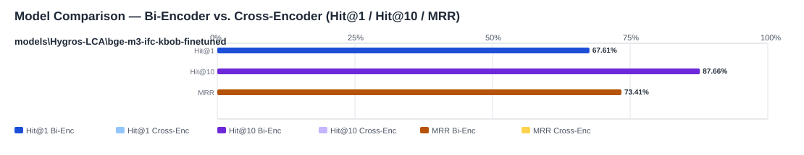

## Evaluation Report

Generated: 2026-05-19 10:00:06

### Inputs
- Summary CSV: `summary_eval-bge-m3-ifc-kbob-finetuned-missing-queries_typos_bge-m3-ifc-kbob-finetuned-c0c6a47a_queries_missing_typo-ba9d4d3a_no-reranker-7521044b.csv`
- Details CSV: `details_eval-bge-m3-ifc-kbob-finetuned-missing-queries_typos_bge-m3-ifc-kbob-finetuned-c0c6a47a_queries_missing_typo-ba9d4d3a_no-reranker-7521044b.csv`

### Overview

### Leaderboard

#### Baseline (Bi-Encoder)

| Rank | Model | Hit@1 | Hit@10 | Hit@20 | Hit@30 | Hit@50 | MRR@10 | MAP@10 | nDCG@10 | Recall@10 | Avg expected score | Hit@1 95% CI | Hit@10 95% CI | MRR@10 95% CI | nDCG@10 95% CI | Top1 errors |
|---:|---|---:|---:|---:|---:|---:|---:|---:|---:|---:|---:|---|---|---|---|---:|
| 1 | models\Hygros-LCA\bge-m3-ifc-kbob-finetuned | 67.61% | 87.66% | 93.83% | 96.40% | 98.20% | 0.734 | 0.681 | 0.728 | 0.802 | 0.836 | [0.626, 0.720] | [0.842, 0.909] | [0.692, 0.771] | [0.689, 0.763] | 126 |

#### Reranked (Bi-Encoder + Cross-Encoder)

| Rank | Model | Cross-Encoder | Hit@1 | Hit@10 | Hit@20 | Hit@30 | Hit@50 | MRR@10 | MAP@10 | nDCG@10 | Recall@10 | Avg expected score | Hit@1 95% CI | Hit@10 95% CI | MRR@10 95% CI | nDCG@10 95% CI | Top1 errors |
|---:|---|---|---:|---:|---:|---:|---:|---:|---:|---:|---:|---:|---|---|---|---|---:|

Anzahl Queries: 389

### Hardest Queries (Baseline)
Queries mit den meisten Top1-Fehlern in der Baseline:

- (2 Fehler) IfcTendonConduit COPULER
- (2 Fehler) IfcBuildingElementPart Sathl
- (2 Fehler) IfcBuildingElementProxy RIAL
- (1 Fehler) IfcBearing CYLINDRIVAL
- (1 Fehler) IfcBearing YCLINDRICAL
