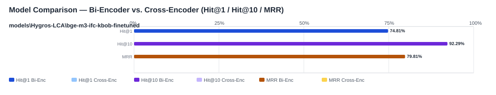

## Evaluation Report

Generated: 2026-05-19 09:59:46

### Inputs
- Summary CSV: `summary_eval-bge-m3-ifc-kbob-finetuned-missing-queries_bge-m3-ifc-kbob-finetuned-c0c6a47a_queries_missing-a91a834f_no-reranker-7521044b.csv`
- Details CSV: `details_eval-bge-m3-ifc-kbob-finetuned-missing-queries_bge-m3-ifc-kbob-finetuned-c0c6a47a_queries_missing-a91a834f_no-reranker-7521044b.csv`

### Overview

### Leaderboard

#### Baseline (Bi-Encoder)

| Rank | Model | Hit@1 | Hit@10 | Hit@20 | Hit@30 | Hit@50 | MRR@10 | MAP@10 | nDCG@10 | Recall@10 | Avg expected score | Hit@1 95% CI | Hit@10 95% CI | MRR@10 95% CI | nDCG@10 95% CI | Top1 errors |
|---:|---|---:|---:|---:|---:|---:|---:|---:|---:|---:|---:|---|---|---|---|---:|
| 1 | models\Hygros-LCA\bge-m3-ifc-kbob-finetuned | 74.81% | 92.29% | 95.89% | 97.94% | 98.46% | 0.798 | 0.748 | 0.791 | 0.859 | 0.867 | [0.703, 0.788] | [0.895, 0.947] | [0.759, 0.829] | [0.755, 0.823] | 98 |

#### Reranked (Bi-Encoder + Cross-Encoder)

| Rank | Model | Cross-Encoder | Hit@1 | Hit@10 | Hit@20 | Hit@30 | Hit@50 | MRR@10 | MAP@10 | nDCG@10 | Recall@10 | Avg expected score | Hit@1 95% CI | Hit@10 95% CI | MRR@10 95% CI | nDCG@10 95% CI | Top1 errors |
|---:|---|---|---:|---:|---:|---:|---:|---:|---:|---:|---:|---:|---|---|---|---|---:|

Anzahl Queries: 389

### Hardest Queries (Baseline)
Queries mit den meisten Top1-Fehlern in der Baseline:

- (6 Fehler) IfcBuildingElementPart TrackElement
- (6 Fehler) IfcRailing HANDRAIL
- (5 Fehler) IfcRailing GUARDRAIL
- (4 Fehler) IfcBuildingElementProxy Stahl
- (2 Fehler) IfcBearing CYLINDRICAL
