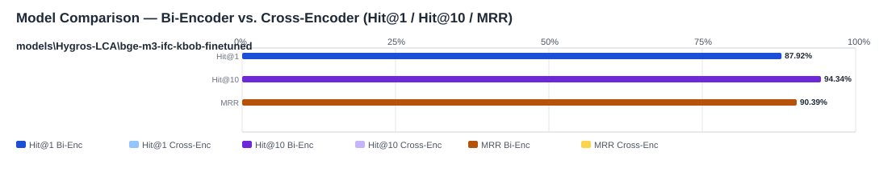

## Evaluation Report

Generated: 2026-05-19 09:59:26

### Inputs
- Summary CSV: `summary_eval-bge-m3-ifc-kbob-finetuned-typos_bge-m3-ifc-kbob-finetuned-c0c6a47a_queries_typos-ec28a584_no-reranker-7521044b.csv`
- Details CSV: `details_eval-bge-m3-ifc-kbob-finetuned-typos_bge-m3-ifc-kbob-finetuned-c0c6a47a_queries_typos-ec28a584_no-reranker-7521044b.csv`

### Overview

### Leaderboard

#### Baseline (Bi-Encoder)

| Rank | Model | Hit@1 | Hit@10 | Hit@20 | Hit@30 | Hit@50 | MRR@10 | MAP@10 | nDCG@10 | Recall@10 | Avg expected score | Hit@1 95% CI | Hit@10 95% CI | MRR@10 95% CI | nDCG@10 95% CI | Top1 errors |
|---:|---|---:|---:|---:|---:|---:|---:|---:|---:|---:|---:|---|---|---|---|---:|
| 1 | models\Hygros-LCA\bge-m3-ifc-kbob-finetuned | 87.92% | 94.34% | 97.69% | 98.46% | 99.49% | 0.904 | 0.842 | 0.872 | 0.887 | 0.880 | [0.843, 0.914] | [0.920, 0.964] | [0.875, 0.931] | [0.843, 0.898] | 47 |

#### Reranked (Bi-Encoder + Cross-Encoder)

| Rank | Model | Cross-Encoder | Hit@1 | Hit@10 | Hit@20 | Hit@30 | Hit@50 | MRR@10 | MAP@10 | nDCG@10 | Recall@10 | Avg expected score | Hit@1 95% CI | Hit@10 95% CI | MRR@10 95% CI | nDCG@10 95% CI | Top1 errors |
|---:|---|---|---:|---:|---:|---:|---:|---:|---:|---:|---:|---:|---|---|---|---|---:|

Anzahl Queries: 389

### Hardest Queries (Baseline)
Queries mit den meisten Top1-Fehlern in der Baseline:

- (1 Fehler) IfcBearing GUIDDE PTEF
- (1 Fehler) IfcBearing G7IDE Polytetralfuoroethylene
- (1 Fehler) IfcBearing GUIED Teflno
- (1 Fehler) IfcCourse ARMOUR5 Gestedin
- (1 Fehler) IfcCourse PAVEENT Asühalt
