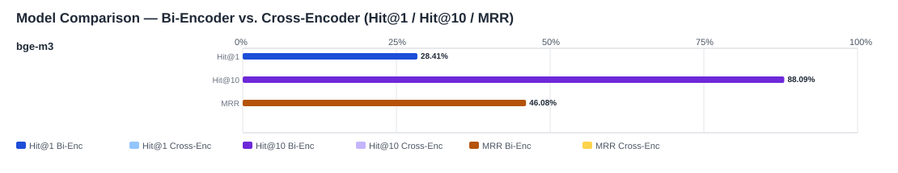

## Evaluation Report

Generated: 2026-04-10 10:41:10

### Inputs
- Summary CSV: `summary_bge-m3_129184_bge-m3-dfabd00b_generated_queries-e9387971_no-reranker-7521044b.csv`
- Details CSV: `details_bge-m3_129184_bge-m3-dfabd00b_generated_queries-e9387971_no-reranker-7521044b.csv`

### Overview

### Leaderboard

#### Baseline (Bi-Encoder)

| Rank | Model | Hit@1 | Hit@10 | Hit@20 | Hit@30 | Hit@50 | MRR@10 | MAP@10 | nDCG@10 | Recall@10 | Avg expected score | Hit@1 95% CI | Hit@10 95% CI | MRR@10 95% CI | nDCG@10 95% CI | Top1 errors |
|---:|---|---:|---:|---:|---:|---:|---:|---:|---:|---:|---:|---|---|---|---|---:|
| 1 | /mnt/nas05/data01/kbob-ai-matcher/models/bge-m3 | 28.41% | 88.09% | 92.99% | 95.73% | 97.81% | 0.461 | 0.414 | 0.531 | 0.827 | 0.541 | [0.277, 0.293] | [0.875, 0.887] | [0.455, 0.468] | [0.525, 0.537] | 7150 |

#### Reranked (Bi-Encoder + Cross-Encoder)

| Rank | Model | Cross-Encoder | Hit@1 | Hit@10 | Hit@20 | Hit@30 | Hit@50 | MRR@10 | MAP@10 | nDCG@10 | Recall@10 | Avg expected score | Hit@1 95% CI | Hit@10 95% CI | MRR@10 95% CI | nDCG@10 95% CI | Top1 errors |
|---:|---|---|---:|---:|---:|---:|---:|---:|---:|---:|---:|---:|---|---|---|---|---:|

Anzahl Queries: 9988

### Hardest Queries (Baseline)
Queries mit den meisten Top1-Fehlern in der Baseline:

- (1 Fehler) IfcBeam S235
- (1 Fehler) IfcBeam S355
- (1 Fehler) IfcBeam S460
- (1 Fehler) IfcBeam Beton PRECAST
- (1 Fehler) IfcBeam Beton C25/30 Fertigteil
