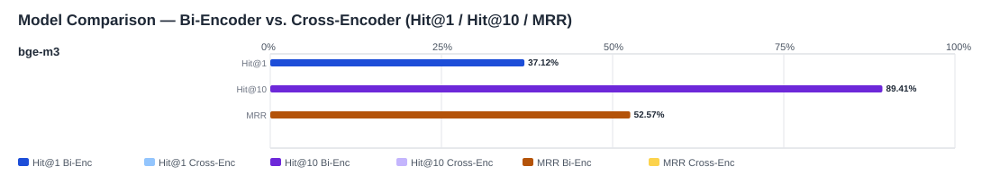

## Evaluation Report

Generated: 2026-04-11 19:57:33

### Inputs
- Summary CSV: `summary_bootstrap_hn_source_bge-m3-dfabd00b_generated_queries-e9387971_no-reranker-7521044b.csv`
- Details CSV: `details_bootstrap_hn_source_bge-m3-dfabd00b_generated_queries-e9387971_no-reranker-7521044b.csv`

### Overview

### Leaderboard

#### Baseline (Bi-Encoder)

| Rank | Model | Hit@1 | Hit@10 | Hit@20 | Hit@30 | Hit@50 | MRR@10 | MAP@10 | nDCG@10 | Recall@10 | Avg expected score | Hit@1 95% CI | Hit@10 95% CI | MRR@10 95% CI | nDCG@10 95% CI | Top1 errors |
|---:|---|---:|---:|---:|---:|---:|---:|---:|---:|---:|---:|---|---|---|---|---:|
| 1 | BAAI/bge-m3 | 37.12% | 89.41% | 93.77% | 96.19% | 98.06% | 0.526 | 0.490 | 0.592 | 0.856 | 0.779 | [0.361, 0.380] | [0.888, 0.899] | [0.518, 0.533] | [0.586, 0.597] | 7158 |

#### Reranked (Bi-Encoder + Cross-Encoder)

| Rank | Model | Cross-Encoder | Hit@1 | Hit@10 | Hit@20 | Hit@30 | Hit@50 | MRR@10 | MAP@10 | nDCG@10 | Recall@10 | Avg expected score | Hit@1 95% CI | Hit@10 95% CI | MRR@10 95% CI | nDCG@10 95% CI | Top1 errors |
|---:|---|---|---:|---:|---:|---:|---:|---:|---:|---:|---:|---:|---|---|---|---|---:|

Anzahl Queries: 11383

### Hardest Queries (Baseline)
Queries mit den meisten Top1-Fehlern in der Baseline:

- (1 Fehler) IfcBeam S235
- (1 Fehler) IfcBeam S355
- (1 Fehler) IfcBeam S460
- (1 Fehler) IfcBeam Beton PRECAST
- (1 Fehler) IfcBeam Beton C25/30 Fertigteil
