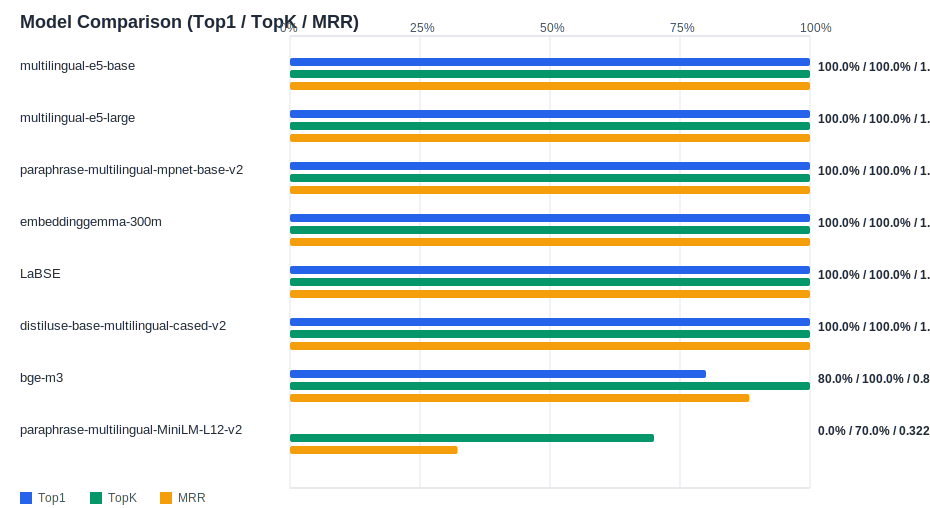

# Evaluation Report

Generated: 2026-02-15 10:45:28

## Inputs
- Summary CSV: `summary_20260215_102821.csv`
- Details CSV: `details_20260215_102821.csv`

## Metric Meaning
- **Top1 Accuracy**: Anteil Queries mit korrektem Material auf Rang 1.
- **TOP5 Accuracy**: Anteil Queries, bei denen das korrekte Material in den Top-K liegt.
- **MRR**: Mittelwert von `1/Rang` des korrekten Treffers (höher = besseres Ranking).
- **Avg Expected Score**: Mittlerer Similarity-Score des korrekten Materials (nur innerhalb eines Modells direkt sinnvoll).

## Overview

## Leaderboard

| Rank | Model | Cases | Top1 | TopK | MRR | Avg expected score | Top1 errors |
|---:|---|---:|---:|---:|---:|---:|---:|
| 1 | intfloat/multilingual-e5-base | 10 | 100.0% | 100.0% | 1.000 | 0.904 | 0 |
| 2 | intfloat/multilingual-e5-large | 10 | 100.0% | 100.0% | 1.000 | 0.901 | 0 |
| 3 | sentence-transformers/paraphrase-multilingual-mpnet-base-v2 | 10 | 100.0% | 100.0% | 1.000 | 0.813 | 0 |
| 4 | google/embeddinggemma-300m | 10 | 100.0% | 100.0% | 1.000 | 0.733 | 0 |
| 5 | sentence-transformers/LaBSE | 10 | 100.0% | 100.0% | 1.000 | 0.637 | 0 |
| 6 | sentence-transformers/distiluse-base-multilingual-cased-v2 | 10 | 100.0% | 100.0% | 1.000 | 0.586 | 0 |
| 7 | BAAI/bge-m3 | 10 | 80.0% | 100.0% | 0.883 | 0.635 | 2 |
| 8 | sentence-transformers/paraphrase-multilingual-MiniLM-L12-v2 | 10 | 0.0% | 70.0% | 0.322 | 0.589 | 10 |

## Hardest Queries
Queries mit den meisten Top1-Fehlern über alle Modelle:

- (2 Fehler) IfcPile , BORED , Betonpfahl , Beton , Pfahlreihe Süd , 900 , Ortbeton
- (2 Fehler) Entity: IfcPile PredefinedType: BORED Name: Betonpfahl Material: Beton Beschrieb: Pfahlreihe Süd Durchmesser: 900 CastingMethod: Ortbeton
- (1 Fehler) IfcPile BORED Betonpfahl Beton Pfahlreihe Süd 900 Ortbeton
- (1 Fehler) Ortbeton IfcPile BORED Betonpfahl Beton Pfahlreihe Süd 900
- (1 Fehler) 900 Ortbeton IfcPile BORED Betonpfahl Beton Pfahlreihe Süd
