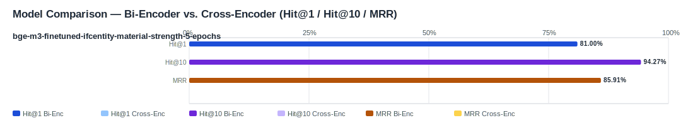

## Evaluation Report

Generated: 2026-03-02 08:28:35

### Inputs
- Summary CSV: `summary_finetuned_Training_artifacts_models_bge-m3-finetuned-ifcentity-material-strength-5-epochs_ifcentity_material_strength_no-reranker.csv`
- Details CSV: `details_finetuned_Training_artifacts_models_bge-m3-finetuned-ifcentity-material-strength-5-epochs_ifcentity_material_strength_no-reranker.csv`

### Overview

### Leaderboard

#### Baseline (Bi-Encoder)

| Rank | Model | Hit@1 | Hit@10 | Hit@20 | Hit@30 | Hit@50 | MRR@10 | MAP@10 | nDCG@10 | Recall@10 | Avg expected score | Hit@1 95% CI | Hit@10 95% CI | MRR@10 95% CI | nDCG@10 95% CI | Top1 errors |
|---:|---|---:|---:|---:|---:|---:|---:|---:|---:|---:|---:|---|---|---|---|---:|
| 1 | Training/artifacts/models/bge-m3-finetuned-ifcentity-material-strength-5-epochs | 81.00% | 94.27% | 99.64% | 99.64% | 100.00% | 0.859 | 0.839 | 0.869 | 0.927 | 0.647 | [0.756, 0.860] | [0.910, 0.968] | [0.817, 0.898] | [0.831, 0.903] | 53 |

#### Reranked (Bi-Encoder + Cross-Encoder)

| Rank | Model | Cross-Encoder | Hit@1 | Hit@10 | Hit@20 | Hit@30 | Hit@50 | MRR@10 | MAP@10 | nDCG@10 | Recall@10 | Avg expected score | Hit@1 95% CI | Hit@10 95% CI | MRR@10 95% CI | nDCG@10 95% CI | Top1 errors |
|---:|---|---|---:|---:|---:|---:|---:|---:|---:|---:|---:|---:|---|---|---|---|---:|

Anzahl Queries: 279

### Hardest Queries (Baseline)
Queries mit den meisten Top1-Fehlern in der Baseline:

- (7 Fehler) IfcWall Beton C30/37
- (6 Fehler) IfcPile Beton C20/25
- (6 Fehler) IfcWall Stahlbeton C30/37
- (4 Fehler) IfcMember Stahl
- (4 Fehler) IfcMember Litze
