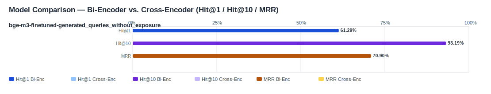

## Evaluation Report

Generated: 2026-03-07 08:45:44

### Inputs
- Summary CSV: `summary_finetuned_bge-m3-finetuned-generated_q-a7fde85a_ifcentity_material_s-aa2be901_no-reranker-7521044b.csv`
- Details CSV: `details_finetuned_bge-m3-finetuned-generated_q-a7fde85a_ifcentity_material_s-aa2be901_no-reranker-7521044b.csv`

### Overview

### Leaderboard

#### Baseline (Bi-Encoder)

| Rank | Model | Hit@1 | Hit@10 | Hit@20 | Hit@30 | Hit@50 | MRR@10 | MAP@10 | nDCG@10 | Recall@10 | Avg expected score | Hit@1 95% CI | Hit@10 95% CI | MRR@10 95% CI | nDCG@10 95% CI | Top1 errors |
|---:|---|---:|---:|---:|---:|---:|---:|---:|---:|---:|---:|---|---|---|---|---:|
| 1 | Training/artifacts/models/bge-m3-finetuned-generated_queries_without_exposure | 61.29% | 93.19% | 94.62% | 95.70% | 98.21% | 0.709 | 0.619 | 0.696 | 0.825 | 0.639 | [0.556, 0.672] | [0.901, 0.957] | [0.668, 0.757] | [0.660, 0.736] | 108 |

#### Reranked (Bi-Encoder + Cross-Encoder)

| Rank | Model | Cross-Encoder | Hit@1 | Hit@10 | Hit@20 | Hit@30 | Hit@50 | MRR@10 | MAP@10 | nDCG@10 | Recall@10 | Avg expected score | Hit@1 95% CI | Hit@10 95% CI | MRR@10 95% CI | nDCG@10 95% CI | Top1 errors |
|---:|---|---|---:|---:|---:|---:|---:|---:|---:|---:|---:|---:|---|---|---|---|---:|

Anzahl Queries: 279

### Hardest Queries (Baseline)
Queries mit den meisten Top1-Fehlern in der Baseline:

- (9 Fehler) IfcMember Holz
- (5 Fehler) IfcBearing S235JR
- (5 Fehler) IfcBearing Stahl
- (5 Fehler) IfcColumn S235JR
- (5 Fehler) IfcPile Beton C20/25
