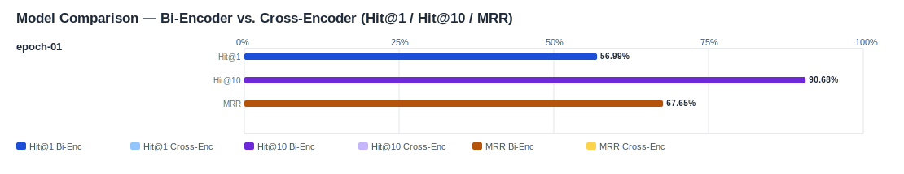

## Evaluation Report

Generated: 2026-03-07 08:48:39

### Inputs
- Summary CSV: `summary_finetuned_epoch-01-666341b5_ifcentity_material_s-aa2be901_no-reranker-7521044b.csv`
- Details CSV: `details_finetuned_epoch-01-666341b5_ifcentity_material_s-aa2be901_no-reranker-7521044b.csv`

### Overview

### Leaderboard

#### Baseline (Bi-Encoder)

| Rank | Model | Hit@1 | Hit@10 | Hit@20 | Hit@30 | Hit@50 | MRR@10 | MAP@10 | nDCG@10 | Recall@10 | Avg expected score | Hit@1 95% CI | Hit@10 95% CI | MRR@10 95% CI | nDCG@10 95% CI | Top1 errors |
|---:|---|---:|---:|---:|---:|---:|---:|---:|---:|---:|---:|---|---|---|---|---:|
| 1 | Training/artifacts/models/bge-m3-finetuned-generated_queries_without_exposure/epochs/epoch-01 | 56.99% | 90.68% | 92.83% | 96.77% | 98.21% | 0.676 | 0.588 | 0.672 | 0.820 | 0.649 | [0.509, 0.638] | [0.871, 0.941] | [0.629, 0.726] | [0.635, 0.715] | 120 |

#### Reranked (Bi-Encoder + Cross-Encoder)

| Rank | Model | Cross-Encoder | Hit@1 | Hit@10 | Hit@20 | Hit@30 | Hit@50 | MRR@10 | MAP@10 | nDCG@10 | Recall@10 | Avg expected score | Hit@1 95% CI | Hit@10 95% CI | MRR@10 95% CI | nDCG@10 95% CI | Top1 errors |
|---:|---|---|---:|---:|---:|---:|---:|---:|---:|---:|---:|---:|---|---|---|---|---:|

Anzahl Queries: 279

### Hardest Queries (Baseline)
Queries mit den meisten Top1-Fehlern in der Baseline:

- (12 Fehler) IfcReinforcingBar Stahl B500B
- (6 Fehler) IfcPlate Hochfester Stahl
- (6 Fehler) IfcRail Stahl
- (5 Fehler) IfcBearing S235JR
- (5 Fehler) IfcBearing Stahl
