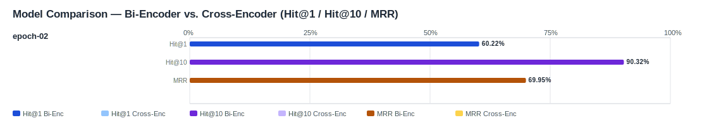

## Evaluation Report

Generated: 2026-03-07 08:49:56

### Inputs
- Summary CSV: `summary_finetuned_epoch-02-dd5bee0b_ifcentity_material_s-aa2be901_no-reranker-7521044b.csv`
- Details CSV: `details_finetuned_epoch-02-dd5bee0b_ifcentity_material_s-aa2be901_no-reranker-7521044b.csv`

### Overview

### Leaderboard

#### Baseline (Bi-Encoder)

| Rank | Model | Hit@1 | Hit@10 | Hit@20 | Hit@30 | Hit@50 | MRR@10 | MAP@10 | nDCG@10 | Recall@10 | Avg expected score | Hit@1 95% CI | Hit@10 95% CI | MRR@10 95% CI | nDCG@10 95% CI | Top1 errors |
|---:|---|---:|---:|---:|---:|---:|---:|---:|---:|---:|---:|---|---|---|---|---:|
| 1 | Training/artifacts/models/bge-m3-finetuned-generated_queries_without_exposure/epochs/epoch-02 | 60.22% | 90.32% | 93.55% | 93.91% | 99.28% | 0.699 | 0.614 | 0.685 | 0.796 | 0.652 | [0.545, 0.663] | [0.871, 0.939] | [0.652, 0.747] | [0.647, 0.727] | 111 |

#### Reranked (Bi-Encoder + Cross-Encoder)

| Rank | Model | Cross-Encoder | Hit@1 | Hit@10 | Hit@20 | Hit@30 | Hit@50 | MRR@10 | MAP@10 | nDCG@10 | Recall@10 | Avg expected score | Hit@1 95% CI | Hit@10 95% CI | MRR@10 95% CI | nDCG@10 95% CI | Top1 errors |
|---:|---|---|---:|---:|---:|---:|---:|---:|---:|---:|---:|---:|---|---|---|---|---:|

Anzahl Queries: 279

### Hardest Queries (Baseline)
Queries mit den meisten Top1-Fehlern in der Baseline:

- (9 Fehler) IfcMember Holz
- (6 Fehler) IfcRail Stahl
- (5 Fehler) IfcBearing S235JR
- (5 Fehler) IfcBearing Stahl
- (5 Fehler) IfcColumn S235JR
