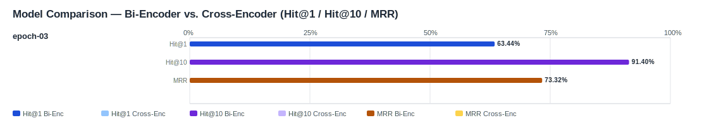

## Evaluation Report

Generated: 2026-03-07 08:51:07

### Inputs
- Summary CSV: `summary_finetuned_epoch-03-acd49624_ifcentity_material_s-aa2be901_no-reranker-7521044b.csv`
- Details CSV: `details_finetuned_epoch-03-acd49624_ifcentity_material_s-aa2be901_no-reranker-7521044b.csv`

### Overview

### Leaderboard

#### Baseline (Bi-Encoder)

| Rank | Model | Hit@1 | Hit@10 | Hit@20 | Hit@30 | Hit@50 | MRR@10 | MAP@10 | nDCG@10 | Recall@10 | Avg expected score | Hit@1 95% CI | Hit@10 95% CI | MRR@10 95% CI | nDCG@10 95% CI | Top1 errors |
|---:|---|---:|---:|---:|---:|---:|---:|---:|---:|---:|---:|---|---|---|---|---:|
| 1 | Training/artifacts/models/bge-m3-finetuned-generated_queries_without_exposure/epochs/epoch-03 | 63.44% | 91.40% | 92.83% | 96.06% | 99.64% | 0.733 | 0.611 | 0.689 | 0.805 | 0.666 | [0.577, 0.690] | [0.882, 0.946] | [0.691, 0.775] | [0.653, 0.731] | 102 |

#### Reranked (Bi-Encoder + Cross-Encoder)

| Rank | Model | Cross-Encoder | Hit@1 | Hit@10 | Hit@20 | Hit@30 | Hit@50 | MRR@10 | MAP@10 | nDCG@10 | Recall@10 | Avg expected score | Hit@1 95% CI | Hit@10 95% CI | MRR@10 95% CI | nDCG@10 95% CI | Top1 errors |
|---:|---|---|---:|---:|---:|---:|---:|---:|---:|---:|---:|---:|---|---|---|---|---:|

Anzahl Queries: 279

### Hardest Queries (Baseline)
Queries mit den meisten Top1-Fehlern in der Baseline:

- (6 Fehler) IfcRail Stahl
- (5 Fehler) IfcBearing S235JR
- (5 Fehler) IfcBearing Stahl
- (5 Fehler) IfcColumn S235JR
- (5 Fehler) IfcPile Beton C20/25
