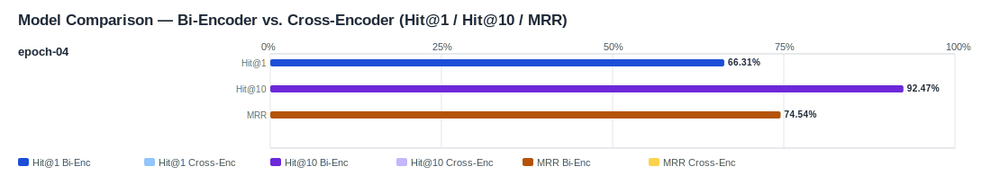

## Evaluation Report

Generated: 2026-03-07 08:54:19

### Inputs
- Summary CSV: `summary_finetuned_epoch-04-6685778a_ifcentity_material_s-aa2be901_no-reranker-7521044b.csv`
- Details CSV: `details_finetuned_epoch-04-6685778a_ifcentity_material_s-aa2be901_no-reranker-7521044b.csv`

### Overview

### Leaderboard

#### Baseline (Bi-Encoder)

| Rank | Model | Hit@1 | Hit@10 | Hit@20 | Hit@30 | Hit@50 | MRR@10 | MAP@10 | nDCG@10 | Recall@10 | Avg expected score | Hit@1 95% CI | Hit@10 95% CI | MRR@10 95% CI | nDCG@10 95% CI | Top1 errors |
|---:|---|---:|---:|---:|---:|---:|---:|---:|---:|---:|---:|---|---|---|---|---:|
| 1 | Training/artifacts/models/bge-m3-finetuned-generated_queries_without_exposure/epochs/epoch-04 | 66.31% | 92.47% | 94.98% | 95.70% | 96.42% | 0.745 | 0.635 | 0.713 | 0.831 | 0.624 | [0.609, 0.724] | [0.894, 0.952] | [0.700, 0.790] | [0.677, 0.754] | 94 |

#### Reranked (Bi-Encoder + Cross-Encoder)

| Rank | Model | Cross-Encoder | Hit@1 | Hit@10 | Hit@20 | Hit@30 | Hit@50 | MRR@10 | MAP@10 | nDCG@10 | Recall@10 | Avg expected score | Hit@1 95% CI | Hit@10 95% CI | MRR@10 95% CI | nDCG@10 95% CI | Top1 errors |
|---:|---|---|---:|---:|---:|---:|---:|---:|---:|---:|---:|---:|---|---|---|---|---:|

Anzahl Queries: 279

### Hardest Queries (Baseline)
Queries mit den meisten Top1-Fehlern in der Baseline:

- (5 Fehler) IfcBearing S235JR
- (5 Fehler) IfcBearing Stahl
- (5 Fehler) IfcColumn S235JR
- (5 Fehler) IfcPile Beton C20/25
- (4 Fehler) IfcMember Stahl
