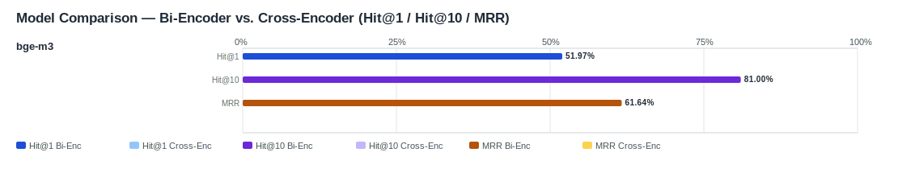

## Evaluation Report

Generated: 2026-03-02 08:37:55

### Inputs
- Summary CSV: `summary_smoke_bge-m3-dfabd00b_ifcentity_material_s-aa2be901_no-reranker-7521044b.csv`
- Details CSV: `details_smoke_bge-m3-dfabd00b_ifcentity_material_s-aa2be901_no-reranker-7521044b.csv`

### Overview

### Leaderboard

#### Baseline (Bi-Encoder)

| Rank | Model | Hit@1 | Hit@10 | Hit@20 | Hit@30 | Hit@50 | MRR@10 | MAP@10 | nDCG@10 | Recall@10 | Avg expected score | Hit@1 95% CI | Hit@10 95% CI | MRR@10 95% CI | nDCG@10 95% CI | Top1 errors |
|---:|---|---:|---:|---:|---:|---:|---:|---:|---:|---:|---:|---|---|---|---|---:|
| 1 | BAAI/bge-m3 | 51.97% | 81.00% | 86.38% | 89.96% | 91.76% | 0.616 | 0.549 | 0.613 | 0.717 | 0.528 | [0.466, 0.581] | [0.767, 0.862] | [0.577, 0.667] | [0.574, 0.662] | 134 |

#### Reranked (Bi-Encoder + Cross-Encoder)

| Rank | Model | Cross-Encoder | Hit@1 | Hit@10 | Hit@20 | Hit@30 | Hit@50 | MRR@10 | MAP@10 | nDCG@10 | Recall@10 | Avg expected score | Hit@1 95% CI | Hit@10 95% CI | MRR@10 95% CI | nDCG@10 95% CI | Top1 errors |
|---:|---|---|---:|---:|---:|---:|---:|---:|---:|---:|---:|---:|---|---|---|---|---:|

Anzahl Queries: 279

### Hardest Queries (Baseline)
Queries mit den meisten Top1-Fehlern in der Baseline:

- (9 Fehler) IfcMember Holz
- (6 Fehler) IfcPile Beton C20/25
- (6 Fehler) IfcPlate Hochfester Stahl
- (6 Fehler) IfcRail Stahl
- (5 Fehler) IfcBearing S235JR
